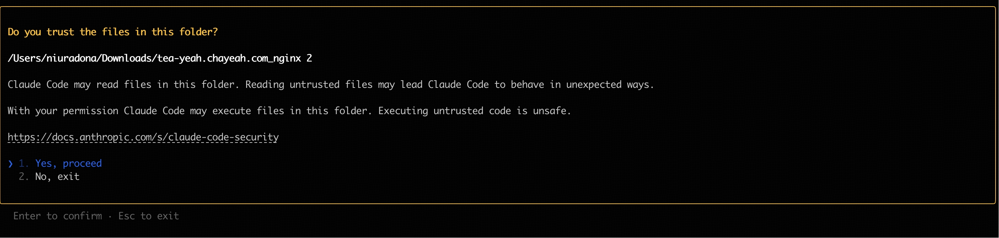
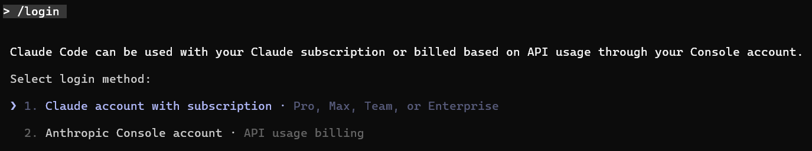
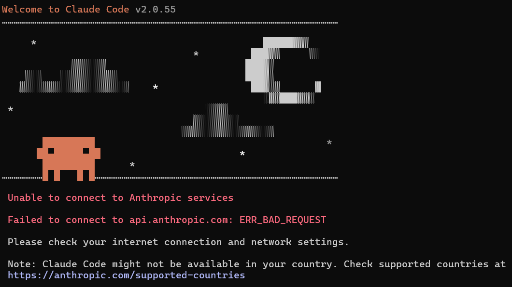

# 1 安装 Claude Code

1. 安装 Claude Code

    官方方法安装 [Claude Code Docs](https://code.claude.com/docs/zh-CN/overview#windows)

    ```
    # macOS/Linux
    curl -fsSL https://claude.ai/install.sh | bash

    # window
    irm https://claude.ai/install.ps1 | iex
    ```

    npm 方式安装

    ```powershell
    # cmd
    npm install -g @anthropic-ai/claude-code
    ```

- 检查是否已安装

  ```python
  claude --version
  ```

# 2 申请  API Key

- deepseek

  在 [DeepSeek 开放平台](https://platform.deepseek.com/api_keys) 创建一个 API key

  【注】创建好后需要立即复杂保存，之后无法再复制
- 智谱

  在 [智谱开放平台](https://open.bigmodel.cn/) 获取 API key

# 3 配置 Claude Code 环境配置

- deepseek

  ```powershell
  export ANTHROPIC_BASE_URL="https://api.deepseek.com/anthropic"
  export ANTHROPIC_AUTH_TOKEN your DeepSeek API Key
  export ANTHROPIC_MODEL=deepseek-chat
  export ANTHROPIC_SMALL_FAST_MODEL=deepseek-chat
  ```
- 智谱 

  ```powershell
  # 在 Cmd 中运行以下命令
  # 注意替换里面的 `your_zhipu_api_key` 为您获取到的 API Key
  setx ANTHROPIC_AUTH_TOKEN your_zhipu_api_key
  setx ANTHROPIC_BASE_URL https://open.bigmodel.cn/api/anthropic # 通用模型
  setx ANTHROPIC_BASE_URL https://open.bigmodel.cn/api/paas/v4/chat/completions
  setx CLAUDE_CODE_DISABLE_NONESSENTIAL_TRAFFIC 1

  # 或在 PowerShell 中运行以下命令
  [System.Environment]::SetEnvironmentVariable('ANTHROPIC_AUTH_TOKEN', 'your_zhipu_api_key', 'User')
  [System.Environment]::SetEnvironmentVariable('ANTHROPIC_BASE_URL', 'https://open.bigmodel.cn/api/anthropic', 'User')
  [System.Environment]::SetEnvironmentVariable('CLAUDE_CODE_DISABLE_NONESSENTIAL_TRAFFIC', '1', 'User')
  ```

# 4 开始使用 Claude Code

- 启动

  ```powershell
  cd your-project # 配置完成后，进入一个您的代码工作目录
  claude # 启动 Claude Code，选择 yes
  ```

  
- 登录

  ```
  # 首次使用时会提示您登录
  /login
  # 按照提示使用您的账户登录
  ```

  

- DeepSeek ：若 API Base URL变成了 DeepSeek 的地址，则配置成功
- GLM ：若 显示 `/model to try Opus 4.5`​ ，则配置成功

> 若启动出现以下问题
>
> 【问题1】
>
> ​
>
> 解决以上问题：在 `C:\Users\yourusername`​ 找到 `.claude.json`​ 加入以下命令
>
> ```powershell
> "hasCompletedOnboarding": true
> ```
>
> 【问题2】因为在此系统上禁止运行脚本
>
> ```powershell
> Set-ExecutionPolicy RemoteSigned -Scope CurrentUser
> ```

‍
