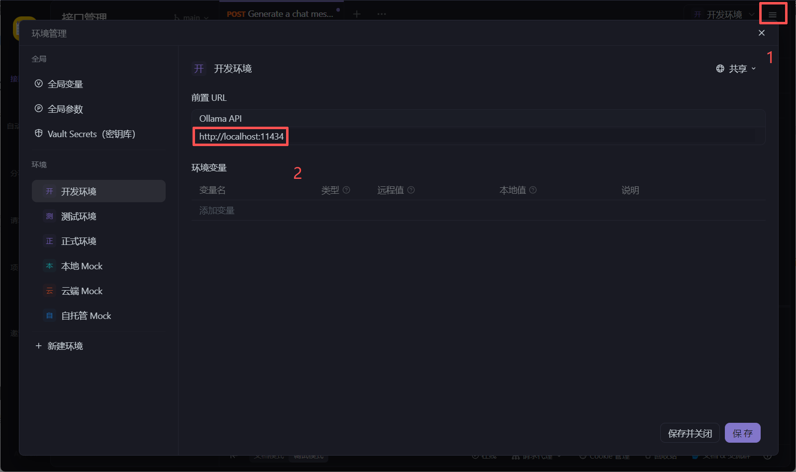
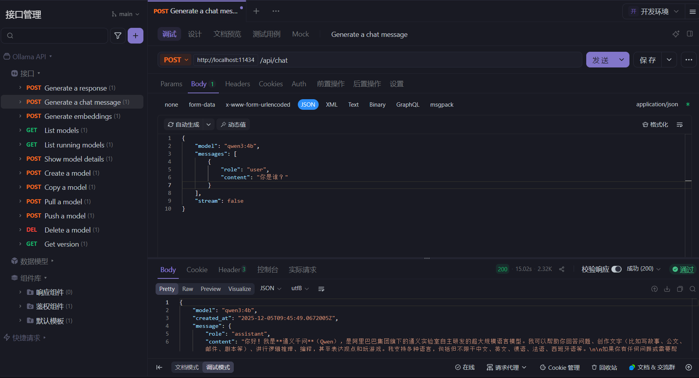
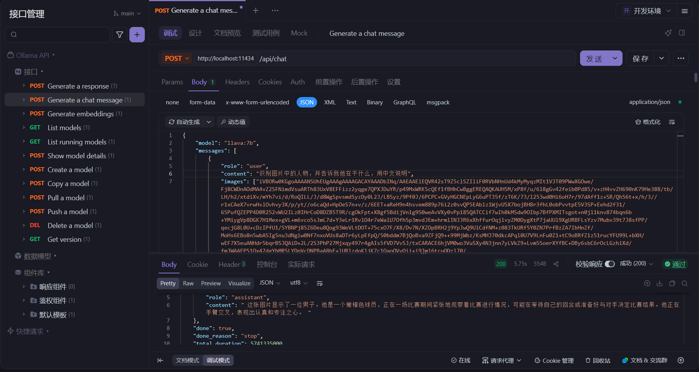
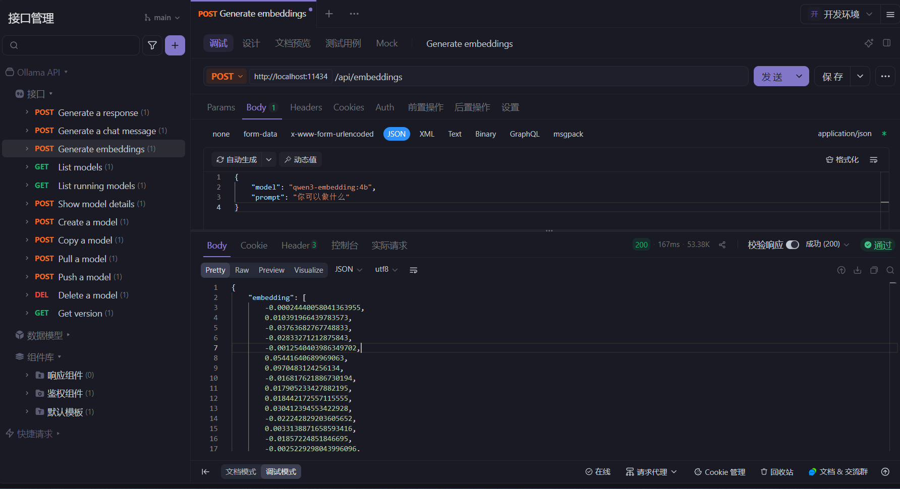
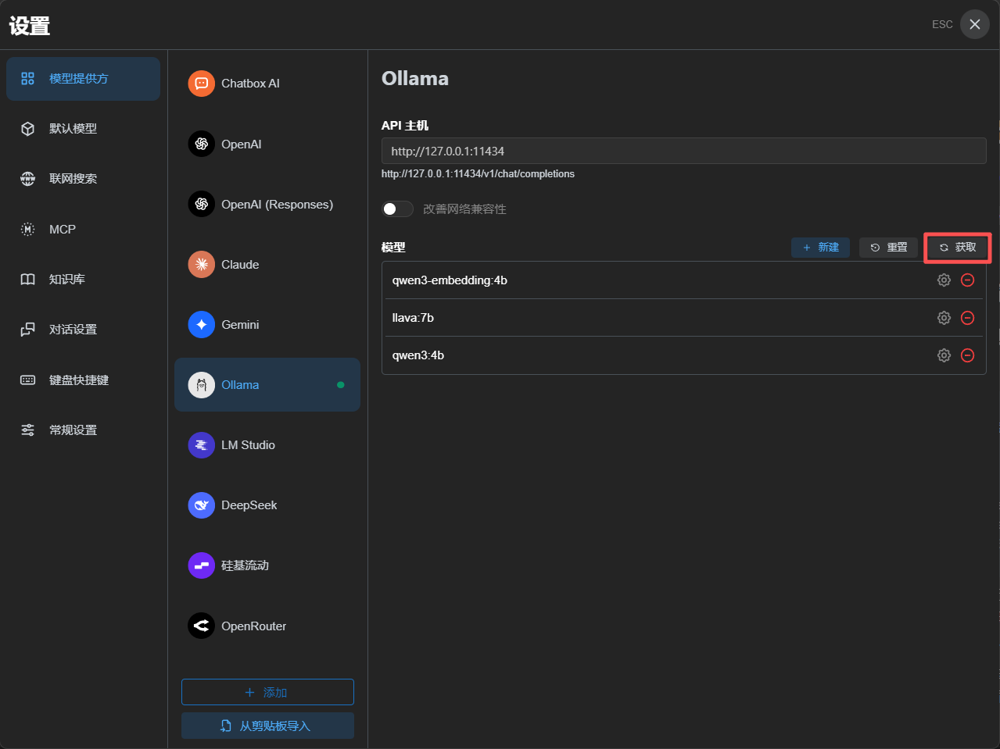
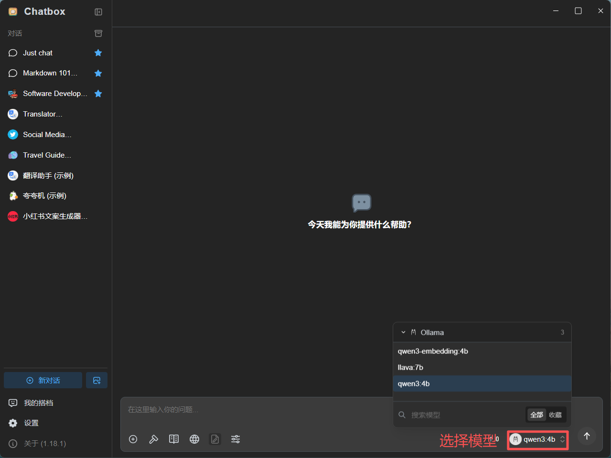

# Ollama + Apifox + Chatbox

> Ollama：一款旨在简化LLM（大型语言模型）本地部署和运行过程的开源软件。
>
> 中文名：羊驼
>
> 网址：[https://ollama.com/](https://ollama.com/)

# Ollama 特点

- 一站式管理：Ollama将模型权重、配置和数据捆绑到一个包中，定义成`Modelfile`​，从而优化了设置和配置细节。
- 热加载模型文件：支持热加载模型文件，无需重新启动即可切换不同的模型，
- 丰富的模型库：提供多种预构建的模型，如Llama 2、Llama 3、通义千问，方便用户快速在本地运行大型语言模型。
- 多平台支持：支持多种操作系统，包括Mac、Windows和Linux，确保了广泛的可用性和灵活性。
- 无复杂依赖：优化推理代码减少不必要的依赖，可以在各种硬件上高效运行。包括纯CPU推理和Apple Silicon架构。
- 资源占用少：Ollama的代码简洁明了，运行时占用资源少，使其能够在本地高效运行，不需要大量的计算资源。

# Linux 手动安装

1. 安装

    在 `/root/resource`​ 目录中已经下载好Linux版本所需的`ollama-linux-amd64.tgz`​文件

    安装命令：

    ```shell
    tar -C /usr -xzf ollama-linux-amd64.tgz
    ```

    验证是否安装成功：

    ```shell
    ollama -v
    ```

    输出版本号，则安装成功

2. 添加开启自启服务

    创建服务文件`/etc/systemd/system/ollama.service`​，并写入文件内容：

    ```shell
    [Unit]
    Description=Ollama Service
    After=network-online.target

    [Service]
    ExecStart=/usr/bin/ollama serve
    User=root
    Group=root
    Restart=always
    RestartSec=3

    [Install]
    WantedBy=default.target
    ```

    生效服务：

    ```shell
    sudo systemctl daemon-reload
    sudo systemctl enable ollama
    ```

    启动服务：

    ```shell
    sudo systemctl start ollama
    ```

# 首次运行模型

查看可用模型：[https://ollama.com/search](https://ollama.com/search)

```shell
ollama run 模型名称:模型规模 # 下载并启动模型
```

# 修改模型路径

ollama软件在各个操作系统上的默认存储路径：

> macOS	 	~/.ollama/models  
> Linux 		~/.ollama/models  
> Windows 	~/.ollama/models

要修改其默认存储路径，需要通过<span data-type="text" style="background-color: var(--b3-card-info-background); color: var(--b3-card-info-color);">设置系统环境变量</span>来实现

### windows

1. 打开系统属性

    ​`win+r`​ 输入：

    ```win
    sysdm.cpl
    ```
2. 高级 <kbd>-&gt;</kbd>​ 环境变量 <kbd>-&gt;</kbd>​ 新建系统变量

    ```win
    变量名：OLLAMA_MODELS
    变量值：C:\xxx\xxx\xxx
    ```

3. 将原有模型迁移到新路径

### linux 

1. 在 `/etc/profile`​ 文件中最后增加一下环境变量（新路径：`/root/ollama`​）：

    ```shell
    export OLLAMA_MODELS=/root/ollama
    ```

2. 执行一命令，生效环境变量：

    ```shell
    >>> source /etc/profile
    >>> echo $OLLAMA_MODELS
    /root/ollama
    ```

3. 迁移原有模型

    ```shell
    >>> systemctl stop ollama
    >>> mkdir -p /root/ollama
    >>> cp -r ~/.ollama/models/* /root/ollama/
    ```
4. 重新ollama服务，则会跳过下载，直接进入大模型：

    ```shell
    >>> ollama ls # 查看已有模型
    >>> ollama run qwen2:0.5b
    >>> 您好
    很高兴为您服务！有什么问题或需要帮助的吗？
    >>> /bye # 终止对话
    ```

5. 修改配置：

    > 上述方式修改后，通过ollama命令是生效的，但是重启电脑则不生效，要解决这个问题，则还需要进行如下配置：
    >

    修改服务文件 `/etc/systemd/system/ollama.service`​ 内容为一下：

    ```shell
    [Unit]
    Description=Ollama Service
    After=network-online.target

    [Service]
    ExecStart=/usr/bin/ollama serve
    User=root
    Group=root
    Restart=always
    RestartSec=3
    Environment="OLLAMA_MODELS=/root/ollama" # *

    [Install]
    WantedBy=default.target
    ```

    生效修改的配置：

    ```shell
    systemctl daemon-reload
    systemctl restart ollama
    ```

# 对话指令

​**​`ollama`​**​ **交互式 REPL 会话的内部快捷键指令**（也称“对话内指令”或“斜杠命令”），仅在 `ollama run`​ 启动后的 `>>>`​ 提示符下生效，**不属于** shell 层面的 CLI 子命令

|命令|作用|模板|
| --------------| --------------------| ------------|
|/set|设置会话变量|​`/set …`​|
|/show|查看模型信息|​`/show …`​|
|/load|切换到另一个模型|​`/load <模型名>`​|
|/save|保存当前会话|​`/save <模型名>`​|
|/clear|清空当前会话上下文|​`/clear`​|
|/bye|退出交互|​`/bye`​|
|/? 和 /help|查看命令帮助|​`/?`​ 或 `/help`​|
|/? shortcuts|键盘快捷键帮助|​`/? shortcuts`​|

### /set 

> 用来设置当前对话模型的<span data-type="text" style="background-color: var(--b3-card-info-background); color: var(--b3-card-info-color);">系列参数</span>

```
>>> /set
Available Commands:
  /set parameter ...     设置对话参数
  /set system <string>   设置系统角色
  /set template <string> 设置推理模版
  /set history           开启对话历史
  /set nohistory         关闭对话历史
  /set wordwrap          开启自动换行
  /set nowordwrap        关闭自动换行
  /set format json       输出JSON格式
  /set noformat          关闭格式输出
  /set verbose           开启对话统计日志
  /set quiet             关闭对话统计日志
```

### /show

> 用于查看当前模型<span data-type="text" style="background-color: var(--b3-card-info-background); color: var(--b3-card-info-color);">详细信息</span>

```shell
>>> /show
Available Commands:
  /show info         查看模型的 基本信息
  /show license      查看模型的 许可信息
  /show modelfile    查看模型的 制作源文件Modelfile，用来制作私有模型
  /show parameters   查看模型的 内置参数信息
  /show system       查看模型的 内置Sytem信息
  /show template     查看模型的 提示词模版
```

### /save

> 把当前模型存储成一个新的模型

```shell
>>> /save name
Created new model 'name'
```

保存的模型存储在ollama的model文件中，进入下面路径即可看见模型文件test：

```shell
>>> pwd
/root/ollama/manifests/registry.ollama.ai/library
>>> ls
deepseek-coder  qwen2  name
```

### /bye

> <span data-type="text" style="background-color: var(--b3-card-info-background); color: var(--b3-card-info-color);">退出当前对话</span>，快捷键: <kbd>ctrl + d</kbd>​

```shell
>>> ollama run qwen2:0.5b
>>> 您好
你好！有什么可以帮助您的吗？
>>> /bye # 退出当前对话
```

### /? shortcuts

> 查看可用的快捷键

```
>>> /? shortcuts
Available keyboard shortcuts:
  Ctrl + a            移动到行头
  Ctrl + e            移动到行尾
  Ctrl + b            移动到单词左边
  Ctrl + f            移动到单词右边
  Ctrl + k            删除游标后面的内容
  Ctrl + u            删除游标前面的内容
  Ctrl + w            删除游标前面的单词

  Ctrl + l            清屏
  Ctrl + c            停止推理输出
  Ctrl + d            退出对话（只有在没有输入时才生效）
```

### /？和 /help

> 查看 ollama 对话中可用的所有指令

```shell
Available Commands:
  /set         	设置会话变量
  /show        	查看模型信息
  /load <model> 切换到另一个模型
  /save <model> 保存当前会话
  /clear       	清空当前会话的上下文
  /bye         	退出交互
  /?, /help    	查看命令帮助
  /? shortcuts  键盘快捷键帮助
```

# CLI 命令

CLI 命令（命令提示符）直接在 **shell 终端里**执行的**顶层命令**

|命令|作用|模板|
| ------------| ------------------| ------|
|run|运行模型|​`ollama run 模型名[:版本] [提示词]`​|
|show|查看模型信息|​`ollama show 模型名[:版本]`​|
|pull|拉取模型|​`ollama pull 模型名[:版本]`​|
|list 和 ls|列出本地模型|​`ollama list`​|
|ps|查看运行中的模型|​`ollama ps`​|
|rm|删除本地模型|​`ollama rm 模型名[:版本]`​|

### run

> 运行模型。若未下载，则下载并启动

```shell
ollama run MODEL[:Version] [PROMPT] [flags]
运行通义千问：
ollama run qwen2:0.5b
```

> ​`[:Version]`​ 	<span data-type="text" style="background-color: var(--b3-card-info-background); color: var(--b3-card-info-color);">版本</span>，不写则为 latest
>
> ​`[PROMPT]`​ 	<span data-type="text" style="background-color: var(--b3-card-info-background); color: var(--b3-card-info-color);">提示词</span>，若带有此参数，则run在执行输入提示词之后即退出终端，即只对话一次
>
> ​`[flags]`​ 	<span data-type="text" style="background-color: var(--b3-card-info-background); color: var(--b3-card-info-color);">参数</span>

```shell
Flags:
      --format string      指定运行的模型输出格式 (比如. json)
      --insecure           使用非安全模式，比如在下载模型时会忽略https的安全证书
      --keepalive string   指定模型在内存中的存活时间
      --nowordwrap         关闭单词自动换行功能
      --verbose            开启统计日志信息
```

​`--verbose`​

```shell
>>> ollama run qwen2:0.5b --verbose
>>> 您好
欢迎光临，我可以为您提供帮助。有什么问题或需要帮助的地方？

total duration:       1.229917477s
load duration:        3.027073ms
prompt eval count:    10 token(s)
prompt eval duration: 167.181ms
prompt eval rate:     59.82 tokens/s
eval count:           16 token(s)
eval duration:        928.995ms
eval rate:            17.22 tokens/s
```

### show

> 不用运行大模型，查看模型的信息。与 `/show`​ 几乎一致

```shell
>>> ollama show -h
Show information for a model

Usage:
  ollama show MODEL [flags]

Flags:
  -h, --help         查看 使用帮助
      --license      查看模型的 许可信息
      --modelfile    查看模型的 制作源文件Modelfile，用来制作私有模型
      --parameters   查看模型的 内置参数信息
      --system       查看模型的 内置Sytem信息
      --template     查看模型的 提示词模版
```

​`--template`​

```shell
>>> ollama show qwen2 --template
{{ if .System }}<|im_start|>system
{{ .System }}<|im_end|>
{{ end }}{{ if .Prompt }}<|im_start|>user
{{ .Prompt }}<|im_end|>
{{ end }}<|im_start|>assistant
{{ .Response }}<|im_end|>
```

### pull

查看可用模型：[https://ollama.com/search](https://ollama.com/search)

> 远程下载指定模型

```
ollama pull MODEL[:Version] [flags]
```

> ​`[:Version]`​ 	<span data-type="text" style="background-color: var(--b3-card-info-background); color: var(--b3-card-info-color);">版本</span>，不写则为 latest

> ​`[flags]`​ 	<span data-type="text" style="background-color: var(--b3-card-info-background); color: var(--b3-card-info-color);">参数</span>，目前只有一个 `--insecure`​ 参数，用于来指定非安全模式下载数据

### list，ls

> 查看本地下载的大模型列表，简写为 `ls`​

```shell
>>> ollama list
NAME                    ID              SIZE    MODIFIED       
qwen2:latest            e0d4e1163c58    4.4 GB  10 minutes ago  
deepseek-coder:latest   3ddd2d3fc8d2    776 MB  3 hours ago     
qwen2:0.5b              6f48b936a09f    352 MB  8 hours ago     
>>> ollama ls
NAME                    ID              SIZE    MODIFIED       
qwen2:latest            e0d4e1163c58    4.4 GB  10 minutes ago  
deepseek-coder:latest   3ddd2d3fc8d2    776 MB  3 hours ago     
qwen2:0.5b              6f48b936a09f    352 MB  8 hours ago   
```

列表字段说明：

|NAME|ID|SIZE|MODIFIED|
| ------| ------------| ----------| --------------|
|名称|模型唯一ID|模型大小|本地存活时间|

【注】在ollama中，不能像docker一下使用ID或ID缩写，只能使用大模型全名称

### ps

> 返回当前运行模型的信息列表

```shell
>>> ollama ps
NAME                    ID              SIZE    PROCESSOR       UNTIL                   
deepseek-coder:latest   3ddd2d3fc8d2    1.3 GB  100% CPU        About a minute from now 
```

列表字段说明：

|NAME|ID|SIZE|PROCESSOR|UNTIL|
| ------| ------------| ----------| -----------| --------------|
|名称|模型唯一ID|模型大小|资源占用|运行存活时长|

### rm

> 删除本地大模型

```shell
>>> ollama ls
NAME                    ID              SIZE    MODIFIED     
qwen2:latest            e0d4e1163c58    4.4 GB  16 hours ago    
deepseek-coder:latest   3ddd2d3fc8d2    776 MB  19 hours ago    
qwen2:0.5b              6f48b936a09f    352 MB  24 hours ago    
>>> ollama rm qwen2:0.5b
deleted 'qwen2:0.5b'
>>> ollama ls
NAME                    ID              SIZE    MODIFIED     
qwen2:latest            e0d4e1163c58    4.4 GB  16 hours ago    
deepseek-coder:latest   3ddd2d3fc8d2    776 MB  19 hours ago    
```

# Ollama 的API

### 开通远程访问（linux）

1. 增加环境变量

    在 `/etc/profile`​ 中增加环境变量：

    ```shell
    export OLLAMA_HOST=0.0.0.0:11434
    export OLLAMA_ORIGINS=*
    ```

    使环境变量生效：

    ```shell
    source /etc/profile
    ```

2. 增加服务变量

    修改服务文件`/etc/systemd/system/ollama.service`​：

    ```shell
    [Unit]
    Description=Ollama Service
    After=network-online.target

    [Service]
    ExecStart=/usr/bin/ollama serve
    User=root
    Group=root
    Restart=always
    RestartSec=3
    Environment="OLLAMA_MODELS=/root/ollama"
    Environment="OLLAMA_HOST=0.0.0.0:11434"
    Environment="OLLAMA_ORIGINS=*"

    [Install]
    WantedBy=default.target
    ```

    生效修改的配置：

    ```shell
    systemctl daemon-reload
    systemctl restart ollama
    ```

3. 开通防火墙

    ```shell
    firewall-cmd --zone=public --add-port=11434/tcp --permanent
    firewall-cmd --reload
    ```

    或可关闭防火墙：

    ```shell
    systemctl stop firewalld
    ```

### API 调试

ollama 接口：[官方中文文档](https://ollama-docs.apifox.cn/)

通过 [Apifox](https://apifox.com/) 使用 ollama 相关的 api

- 导入 `Ollama.apifox.json`​ 或 [官方](https://github.com/ollama/ollama/tree/main/docs)的规则文件 `openapi.yaml`​

  ```shell
  # Ollama.apifox.json
  {"apifoxProject":"1.0.0","$schema":{"app":"apifox","type":"project","version":"1.2.0"},"info":{"name":"Ollama","description":"","mockRule":{"rules":[],"enableSystemRule":true}},"apiCollection":[{"name":"根目录","id":36342934,"auth":{},"parentId":0,"serverId":"","description":"","identityPattern":{"httpApi":{"type":"methodAndPath","bodyType":"","fields":[]}},"preProcessors":[{"id":"inheritProcessors","type":"inheritProcessors","data":{}}],"postProcessors":[{"id":"inheritProcessors","type":"inheritProcessors","data":{}}],"inheritPostProcessors":{},"inheritPreProcessors":{},"items":[{"name":"内容生成接口","api":{"id":"185881920","method":"post","path":"/api/generate","parameters":{},"auth":{},"commonParameters":{"query":[],"body":[],"cookie":[],"header":[]},"responses":[{"id":"474170313","name":"成功","code":200,"contentType":"json","jsonSchema":{"type":"object","properties":{},"x-apifox-orders":["01J0SR9FW2X48MECSNKBG2884W"],"required":[],"x-apifox-refs":{"01J0SR9FW2X48MECSNKBG2884W":{"$ref":"#/definitions/103899701"}}}}],"responseExamples":[],"requestBody":{"type":"application/json","parameters":[],"jsonSchema":{"type":"object","properties":{},"x-apifox-orders":["01J0SR8DGRJ1VN160WA141534Q"],"required":[],"x-apifox-refs":{"01J0SR8DGRJ1VN160WA141534Q":{"$ref":"#/definitions/103897734"}}}},"description":"","tags":[],"status":"released","serverId":"","operationId":"","sourceUrl":"","ordering":10,"cases":[],"mocks":[],"customApiFields":"{}","advancedSettings":{"disabledSystemHeaders":{}},"mockScript":{},"codeSamples":[],"commonResponseStatus":{},"responseChildren":["BLANK.474170313"],"preProcessors":[],"postProcessors":[],"inheritPostProcessors":{},"inheritPreProcessors":{}}},{"name":"聊天对话接口","api":{"id":"185941629","method":"post","path":"/api/chat","parameters":{},"auth":{},"commonParameters":{"query":[],"body":[],"cookie":[],"header":[]},"responses":[{"id":"474273276","name":"成功","code":200,"contentType":"json","jsonSchema":{"type":"object","properties":{},"x-apifox-orders":["01J0SVB8APH9WQ48VAY553XFH7"],"x-apifox-refs":{"01J0SVB8APH9WQ48VAY553XFH7":{"$ref":"#/definitions/103919358"}},"required":[]}}],"responseExamples":[],"requestBody":{"type":"application/json","parameters":[],"jsonSchema":{"type":"object","properties":{},"x-apifox-orders":["01J0SVAWXKXYJZDZ1E0RJ6WHV1"],"x-apifox-refs":{"01J0SVAWXKXYJZDZ1E0RJ6WHV1":{"$ref":"#/definitions/103918603"}},"required":[]}},"description":"","tags":[],"status":"released","serverId":"","operationId":"","sourceUrl":"","ordering":16,"cases":[],"mocks":[],"customApiFields":"{}","advancedSettings":{"disabledSystemHeaders":{}},"mockScript":{},"codeSamples":[],"commonResponseStatus":{},"responseChildren":["BLANK.474273276"],"preProcessors":[],"postProcessors":[],"inheritPostProcessors":{},"inheritPreProcessors":{}}},{"name":"向量化接口","api":{"id":"185951927","method":"post","path":"/api/embeddings","parameters":{},"auth":{},"commonParameters":{"query":[],"body":[],"cookie":[],"header":[]},"responses":[{"id":"474281616","name":"成功","code":200,"contentType":"json","jsonSchema":{"type":"object","properties":{"embedding":{"type":"array","items":{"type":"number"},"title":"向量化数组"}},"x-apifox-orders":["embedding"],"x-apifox-refs":{},"required":["embedding"]}}],"responseExamples":[],"requestBody":{"type":"application/json","parameters":[],"jsonSchema":{"type":"object","properties":{},"x-apifox-orders":["01J0SVP7630ZWKZXBRM7KBZK0X"],"x-apifox-refs":{"01J0SVP7630ZWKZXBRM7KBZK0X":{"$ref":"#/definitions/103926278"}},"required":[]}},"description":"","tags":[],"status":"released","serverId":"","operationId":"","sourceUrl":"","ordering":22,"cases":[],"mocks":[],"customApiFields":"{}","advancedSettings":{"disabledSystemHeaders":{}},"mockScript":{},"codeSamples":[],"commonResponseStatus":{},"responseChildren":["BLANK.474281616"],"preProcessors":[],"postProcessors":[],"inheritPostProcessors":{},"inheritPreProcessors":{}}},{"name":"查询运行中的模型列表","api":{"id":"186029837","method":"get","path":"/api/ps","parameters":{},"auth":{},"commonParameters":{"query":[],"body":[],"cookie":[],"header":[]},"responses":[{"id":"474480954","name":"成功","code":200,"contentType":"json","jsonSchema":{"type":"object","properties":{},"x-apifox-orders":["01J0T5NZMBGA5MK5MG1C1MH7PB"],"x-apifox-refs":{"01J0T5NZMBGA5MK5MG1C1MH7PB":{"$ref":"#/definitions/103970286"}},"required":[]}}],"responseExamples":[],"requestBody":{"type":"application/json","parameters":[],"jsonSchema":{"type":"object","properties":{},"x-apifox-orders":[],"x-apifox-refs":{}}},"description":"","tags":[],"status":"released","serverId":"","operationId":"","sourceUrl":"","ordering":28,"cases":[],"mocks":[],"customApiFields":"{}","advancedSettings":{"disabledSystemHeaders":{}},"mockScript":{},"codeSamples":[],"commonResponseStatus":{},"responseChildren":["BLANK.474480954"],"preProcessors":[],"postProcessors":[],"inheritPostProcessors":{},"inheritPreProcessors":{}}},{"name":"查询可用的模型列表","api":{"id":"186038704","method":"get","path":"/api/tags","parameters":{},"auth":{},"commonParameters":{"query":[],"body":[],"cookie":[],"header":[]},"responses":[{"id":"474497977","name":"成功","code":200,"contentType":"json","jsonSchema":{"type":"object","properties":{},"x-apifox-orders":["01J0T5NZMBGA5MK5MG1C1MH7PB"],"x-apifox-refs":{"01J0T5NZMBGA5MK5MG1C1MH7PB":{"$ref":"#/definitions/103970286"}},"required":[]}}],"responseExamples":[],"requestBody":{"type":"application/json","parameters":[],"jsonSchema":{"type":"object","properties":{},"x-apifox-orders":[],"x-apifox-refs":{}}},"description":"","tags":[],"status":"released","serverId":"","operationId":"","sourceUrl":"","ordering":34,"cases":[],"mocks":[],"customApiFields":"{}","advancedSettings":{"disabledSystemHeaders":{}},"mockScript":{},"codeSamples":[],"commonResponseStatus":{},"responseChildren":["BLANK.474497977"],"preProcessors":[],"postProcessors":[],"inheritPostProcessors":{},"inheritPreProcessors":{}}},{"name":"拉取模型","api":{"id":"186045924","method":"post","path":"/api/pull","parameters":{},"auth":{},"commonParameters":{"query":[],"body":[],"cookie":[],"header":[]},"responses":[{"id":"474515104","name":"成功","code":200,"contentType":"json","jsonSchema":{"type":"object","properties":{"status":{"type":"string","title":"状态","description":"pulling manifest，downloading digestname，verifying sha256 digest，writing manifest，removing any unused layers，success"},"total":{"type":"integer","title":"总大小"},"completed":{"type":"integer","title":"完成的大小"},"digest":{"type":"string","title":"摘要算法名"}},"x-apifox-orders":["status","total","completed","digest"],"x-apifox-refs":{},"required":["status"]}}],"responseExamples":[],"requestBody":{"type":"application/json","parameters":[],"jsonSchema":{"type":"object","properties":{"name":{"type":"string","title":"模型名称"},"insecure":{"type":"boolean","title":"是否非安全模式"},"stream":{"type":"boolean","title":"是否返回流信息"}},"x-apifox-orders":["name","insecure","stream"],"x-apifox-refs":{},"required":["name"]}},"description":"","tags":[],"status":"released","serverId":"","operationId":"","sourceUrl":"","ordering":40,"cases":[],"mocks":[],"customApiFields":"{}","advancedSettings":{"disabledSystemHeaders":{}},"mockScript":{},"codeSamples":[],"commonResponseStatus":{},"responseChildren":["BLANK.474515104"],"preProcessors":[],"postProcessors":[],"inheritPostProcessors":{},"inheritPreProcessors":{}}},{"name":"删除模型","api":{"id":"186080432","method":"delete","path":"/api/delete","parameters":{},"auth":{},"commonParameters":{"query":[],"body":[],"cookie":[],"header":[]},"responses":[{"id":"474546875","name":"成功","code":200,"contentType":"json","jsonSchema":{"type":"object","properties":{},"x-apifox-orders":[],"x-apifox-refs":{}}}],"responseExamples":[],"requestBody":{"type":"application/json","parameters":[],"jsonSchema":{"type":"object","properties":{"name":{"type":"string","title":"模型名称"}},"x-apifox-orders":["name"],"x-apifox-refs":{},"required":["name"]}},"description":"","tags":[],"status":"released","serverId":"","operationId":"","sourceUrl":"","ordering":46,"cases":[],"mocks":[],"customApiFields":"{}","advancedSettings":{"disabledSystemHeaders":{}},"mockScript":{},"codeSamples":[],"commonResponseStatus":{},"responseChildren":["BLANK.474546875"],"preProcessors":[],"postProcessors":[],"inheritPostProcessors":{},"inheritPreProcessors":{}}}]}],"socketCollection":[],"docCollection":[],"responseCollection":[{"id":4702570,"createdAt":"2024-06-20T02:20:48.000Z","updatedAt":"2024-06-20T02:20:48.000Z","deletedAt":null,"name":"根目录","type":"root","description":"","children":[],"auth":{},"projectId":4688822,"projectBranchId":0,"parentId":0,"createdById":2336402,"updatedById":2336402,"items":[]}],"schemaCollection":[{"name":"根目录","items":[{"name":"内容生成请求模型","displayName":"","id":"#/definitions/103897734","description":"","schema":{"jsonSchema":{"type":"object","properties":{"model":{"type":"string","title":"模型名称"},"prompt":{"type":"string","title":"提示词"},"stream":{"type":"boolean","title":"是否流式生成"},"options":{"type":"object","properties":{"seed":{"type":"integer","title":"生成种子"},"top_k":{"type":"integer","title":"多样度","description":"越高越多样，默认40"},"top_p":{"type":"number","title":"保守度","description":"越低越保守，默认0.9"},"repeat_last_n":{"type":"integer","title":"防重复回顾距离","description":"默认: 64, 0 = 禁用, -1 = num_ctx"},"temperature":{"type":"number","title":"温度值","description":"越高创造性越强，默认0.8"},"repeat_penalty":{"type":"number","title":"重复惩罚强度","description":"越高惩罚越强，默认1.1"},"stop":{"type":"array","items":{"type":"string"},"title":"停止词"}},"required":["stop"],"x-apifox-orders":["seed","top_k","top_p","repeat_last_n","temperature","repeat_penalty","stop"],"title":"配置参数"},"format":{"type":"string","title":"响应格式"},"keep_alive":{"type":"string","title":"模型内存保持时间","description":"5m"},"context":{"type":"string","title":"记忆上下文","description":"上一次对话返回的值"},"system":{"type":"string","title":"角色扮演提示词","description":"覆盖模型的sytem"},"template":{"type":"string","title":"提示词模版","description":"覆盖模型的模版"}},"required":["model","prompt"],"x-apifox-orders":["model","prompt","format","stream","keep_alive","context","system","template","options"]}}},{"name":"聊天对话请求模型","displayName":"","id":"#/definitions/103918603","description":"","schema":{"jsonSchema":{"type":"object","properties":{"model":{"type":"string","title":"模型名称"},"stream":{"type":"boolean","title":"是否流式生成"},"options":{"type":"object","properties":{"seed":{"type":"integer","title":"生成种子"},"top_k":{"type":"integer","title":"多样度","description":"越高越多样，默认40"},"top_p":{"type":"number","title":"保守度","description":"越低越保守，默认0.9"},"repeat_last_n":{"type":"integer","title":"防重复回顾距离","description":"默认: 64, 0 = 禁用, -1 = num_ctx"},"temperature":{"type":"number","title":"温度值","description":"越高创造性越强，默认0.8"},"repeat_penalty":{"type":"number","title":"重复惩罚强度","description":"越高惩罚越强，默认1.1"},"stop":{"type":"array","items":{"type":"string"},"title":"停止词"}},"required":["stop"],"x-apifox-orders":["seed","top_k","top_p","repeat_last_n","temperature","repeat_penalty","stop"],"title":"配置参数"},"format":{"type":"string","title":"响应格式"},"keep_alive":{"type":"string","title":"模型内存保持时间","description":"5m"},"messages":{"type":"array","items":{"type":"object","properties":{"role":{"type":"string","title":"角色","description":"system、user或assistant"},"content":{"type":"string","title":"内容"},"images":{"type":"string","title":"图像"}},"x-apifox-orders":["role","content","images"],"required":["role","content"]},"title":"聊天消息"}},"required":["model","messages"],"x-apifox-orders":["model","messages","format","stream","keep_alive","options"]}}},{"name":"向量化请求模型","displayName":"","id":"#/definitions/103926278","description":"","schema":{"jsonSchema":{"type":"object","properties":{"model":{"type":"string","title":"模型名称"},"options":{"type":"object","properties":{"seed":{"type":"integer","title":"生成种子"},"top_k":{"type":"integer","title":"多样度","description":"越高越多样，默认40"},"top_p":{"type":"number","title":"保守度","description":"越低越保守，默认0.9"},"repeat_last_n":{"type":"integer","title":"防重复回顾距离","description":"默认: 64, 0 = 禁用, -1 = num_ctx"},"temperature":{"type":"number","title":"温度值","description":"越高创造性越强，默认0.8"},"repeat_penalty":{"type":"number","title":"重复惩罚强度","description":"越高惩罚越强，默认1.1"},"stop":{"type":"array","items":{"type":"string"},"title":"停止词"}},"required":["stop"],"x-apifox-orders":["seed","top_k","top_p","repeat_last_n","temperature","repeat_penalty","stop"],"title":"配置参数"},"keep_alive":{"type":"string","title":"模型内存保持时间","description":"5m"},"prompt":{"type":"string","title":"要向量化的文本"}},"required":["model","prompt"],"x-apifox-orders":["model","prompt","keep_alive","options"]}}},{"name":"内容生成响应模型","displayName":"","id":"#/definitions/103899701","description":"","schema":{"jsonSchema":{"type":"object","properties":{"model":{"type":"string","title":"模型"},"created_at":{"type":"string","title":"响应时间"},"response":{"type":"string","title":"响应内容"},"done":{"type":"boolean"},"context":{"type":"array","items":{"type":"integer"},"title":"会话上下文编码","description":"可以在下一个请求中发送此值以保持会话记忆"},"total_duration":{"type":"integer","title":"总耗时"},"load_duration":{"type":"integer","title":"模型加载耗时"},"prompt_eval_count":{"type":"integer","title":"提示词token消耗数"},"prompt_eval_duration":{"type":"integer","title":"提示词耗时"},"eval_count":{"type":"integer","title":"响应token消耗数"},"eval_duration":{"type":"integer","title":"响应耗时"}},"required":["model","created_at","response","eval_duration"],"x-apifox-orders":["model","created_at","response","done","context","total_duration","load_duration","prompt_eval_count","prompt_eval_duration","eval_count","eval_duration"]}}},{"name":"聊天对话响应模型","displayName":"","id":"#/definitions/103919358","description":"","schema":{"jsonSchema":{"type":"object","properties":{"model":{"type":"string","title":"模型"},"created_at":{"type":"string","title":"响应时间"},"done":{"type":"boolean"},"total_duration":{"type":"integer","title":"总耗时"},"load_duration":{"type":"integer","title":"模型加载耗时"},"prompt_eval_count":{"type":"integer","title":"提示词token消耗数"},"prompt_eval_duration":{"type":"integer","title":"提示词耗时"},"eval_count":{"type":"integer","title":"响应token消耗数"},"eval_duration":{"type":"integer","title":"响应耗时"},"message":{"type":"object","properties":{"role":{"type":"string","title":"角色"},"content":{"type":"string","title":"内容"}},"x-apifox-orders":["role","content"],"title":"响应内容","required":["role","content"]}},"required":["model","created_at","message"],"x-apifox-orders":["model","created_at","message","done","total_duration","load_duration","prompt_eval_count","prompt_eval_duration","eval_count","eval_duration"]}}},{"name":"运行中的模型列表模型","displayName":"","id":"#/definitions/103970286","description":"","schema":{"jsonSchema":{"type":"object","properties":{"models":{"type":"array","items":{"type":"object","properties":{"name":{"type":"string","title":"模型名称"},"model":{"type":"string","title":"模型名称"},"size":{"type":"integer","title":"模型大小"},"digest":{"type":"string","title":"加密摘要"},"details":{"type":"object","properties":{"parent_model":{"type":"string","title":"父模型"},"format":{"type":"string","title":"格式","description":"比如guuf"},"family":{"type":"string","title":"家族名称"},"families":{"type":"array","items":{"type":"string"},"title":"家族名称"},"parameter_size":{"type":"string","title":"规模大小"},"quantization_level":{"type":"string","title":"量化级别"}},"required":["parent_model","format","family","families","parameter_size","quantization_level"],"x-apifox-orders":["parent_model","format","family","families","parameter_size","quantization_level"]},"expires_at":{"type":"string","title":"运行开始时间"},"size_vram":{"type":"integer","title":"占用大小"}},"x-apifox-orders":["name","model","size","digest","details","expires_at","size_vram"]}}},"required":["models"],"x-apifox-orders":["models"]}}}]}],"apiTestCaseCollection":[{"name":"根目录","children":[],"items":[]}],"testCaseReferences":[],"environments":[],"commonScripts":[],"databaseConnections":[],"globalVariables":[],"commonParameters":null,"projectSetting":{"id":"4699589","auth":{},"servers":[{"id":"default","name":"默认服务"}],"gateway":[],"language":"zh-CN","apiStatuses":["developing","testing","released","deprecated"],"mockSettings":{},"preProcessors":[],"postProcessors":[],"advancedSettings":{},"initialDisabledMockIds":[],"cloudMock":{"security":"free","enable":false,"tokenKey":"apifoxToken"}},"customFunctions":[],"projectAssociations":[]}
  ```

  - 进入 Apifox（网页端、客户端）<kbd>-&gt;</kbd>​ 导入文件

  - 选择导入数据格式：Apifox（OpenAPI） <kbd>-&gt;</kbd>​ 导入 `Ollama.apifox.json`​ （`openapi.yaml`​）
- 选择-接口
- 请求（测试）：编写参数 —— 预览文档（可查看必写参数）
- 右上角选择-开发环境 <kbd>-&gt;</kbd>​ 设置 url 为 `http://localhost:11434`​ <kbd>-&gt;</kbd>​ 点击发送

  ​

###### API 接口

|接口名称|方法|路径|描述|
| ------------------| --------| -----------------| ------------------------|
|内容生成接口|POST|/api/generate|生成文本内容|
|聊天对话接口|POST|/api/chat|进行对话交互|
|向量化接口|POST|/api/embeddings|文本向量化|
|查询运行中的模型|GET|/api/ps|获取当前运行的模型列表|
|查询可用的模型|GET|/api/tags|获取本地模型列表|
|拉取模型|POST|/api/pull|下载远程模型|
|删除模型|DELETE|/api/delete|删除本地模型|

###### 聊天对话接口-文字形式



```powershell
ollama run qwen3:4b
```

> POST /api/chat

```json
// 最基础
{
    "model": "qwen3:4b",
    "messages": [
        {
            "role": "user",
            "content": "你是谁？"
        }
    ],
    "stream": false
}
```

###### 聊天对话接口-图片形式

> **LLaVA**（ Large Language and Vision Assistant）是一个开源的多模态大模型，它可以同时处理文本、图像和其他类型的数据，实现跨模态的理解和生成。
>
> 网址:[https://github.com/haotian-liu/LLaVA.git](https://github.com/haotian-liu/LLaVA.git)



```powershell
ollama run llava:7b
```

将图片数据转出Base64字符串：

```python
import base64
from PIL import Image
def compress_and_convert():
    # 打开图片
    img = Image.open("picture.png")
    # 压缩图片
    if img.size[0] > 512 or img.size[1] > 512:
        img.thumbnail((512, 512), Image.Resampling.LANCZOS)
    # 保存到临时文件
    temp_file = "temp_compressed.png"
    img.save(temp_file, format='PNG', optimize=True, quality=85)
    # 读取文件内容
    with open(temp_file, "rb") as f:
        bytes_data = f.read()
    # Base64编码
    base64_str = base64.b64encode(bytes_data).decode('utf-8')
    print(base64_str)
if __name__ == "__main__":
    compress_and_convert()
```

> POST /api/chat

```json
{
    "model": "llava:7b",
    "messages": [
        {
            "role": "user",
            "content": "识别图片中的人物，并告诉我他在干什么",
			"images": [""]
        }
    ],
    "stream": false
}
```

###### 向量化接口



```python
ollama pull qwen3-embedding:4b
```

> POST /api/embed

```json
{
    "model": "qwen3-embedding:4b",
    "prompt": "你可以做什么"
}
```

# Ollama 与 ChatBox

> ChatBox：多平台 AI 聊天客户端，可通过 API 集成多个AI模型
>
> 网址：[https://chatboxai.app/zh](https://chatboxai.app/zh)

在ChatBox中使用Ollama中的大模型

1. 运行本地大模型

    ```shell
    ollama run qwen3:4b --keepalive 1h
    ```

2. 在 ChatBox 中配置模型

    点击获取，获取本机大模型

    

3. 选择模型并开始对话

    

‍
