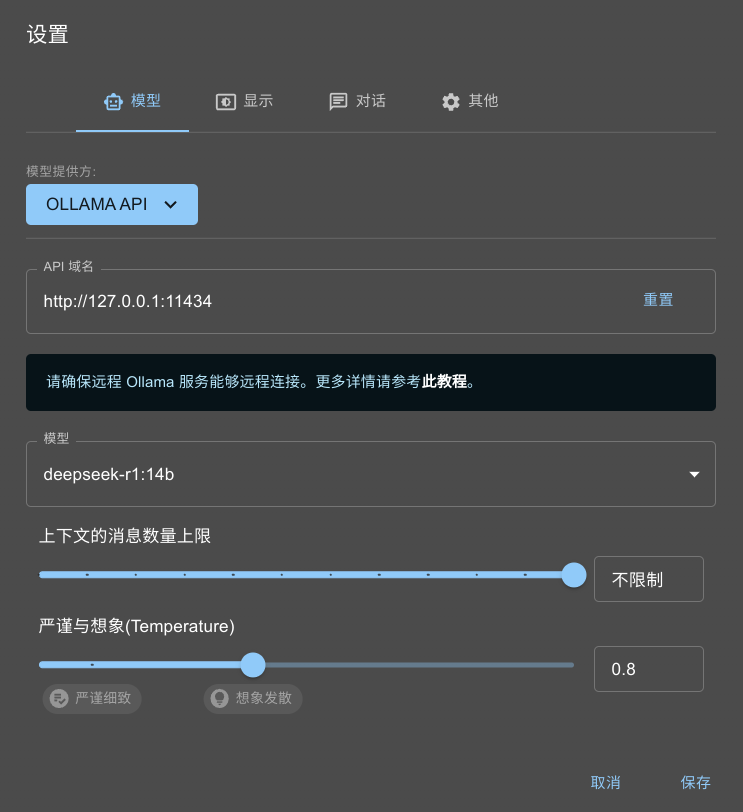
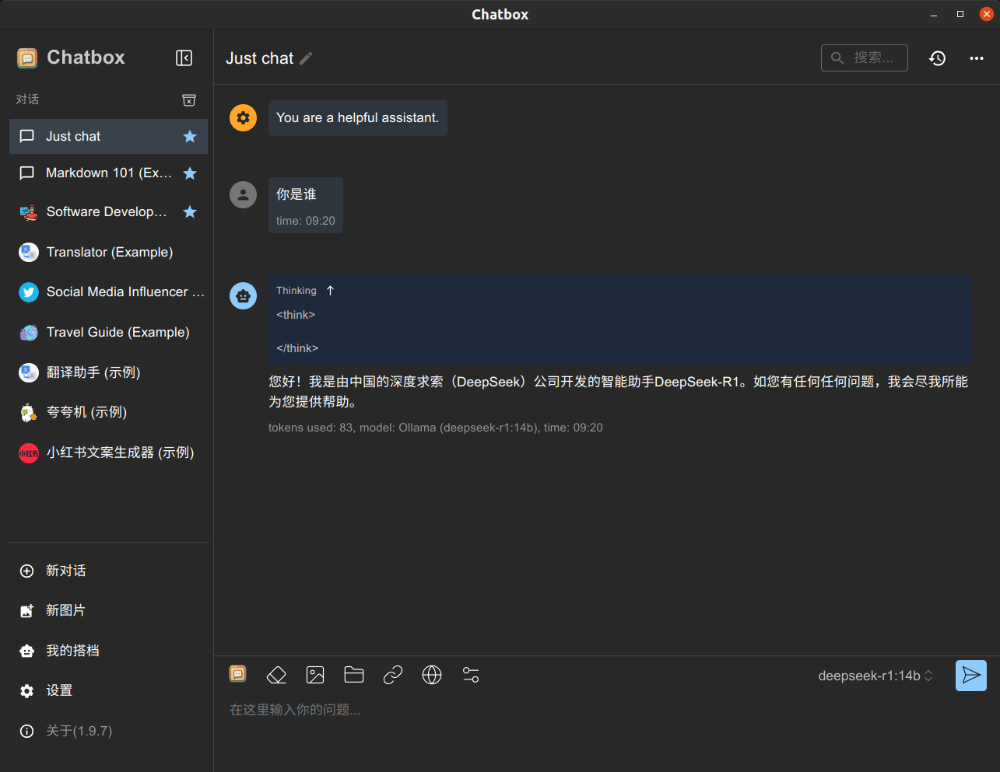

## Ubuntu Linux 部署 DeepSeek

通过Ollama来部署DeepSeek R1模型，由于网络环境的问题，过程相比于普通的安装方案可能略有改动。

## 安装Ollama

什么是Ollama

Ollama 是一个开源工具，专门用于在本地运行、管理和部署大型语言模型（LLMs，Large Language Models）。它简化了 LLMs 的安装、配置和运行流程，支持多种流行的开源模型（如 LLaMA、Mistral、DeepSeek 等），适合开发者和研究人员在本地环境中快速实验和开发。

Ollama的官网地址：[https://ollama.com](https://ollama.com/)从官网下载适合自己本地环境的版本

```Shell
curl -fsSL https://ollama.com/install.sh | sh
```

- 若出现类似的报错

> ```Shell
> curl: (22) The requested URL returned error: 403
> ```
>
> 1. 首先用curl下载一个安装脚本：
>
>     ```Shell
>     $ curl -fsSL https://ollama.com/install.sh -o ollama_install.sh
>     $ chmod +x ollama_install.sh       //添加权限
>     ```
>
> 2. 把默认的Ollama下载地址指向Github下载地址：
>
>     ```Shell
>     $ sed -i 's|https://ollama.com/download/|https://github.com/ollama/ollama/releases/download/v0.5.7/|' ollama_install.sh
>     ```
>
>     【注】需修改到自己所需的版本地址
>
> 3. 执行脚本文件，开始下载
>
>     ```Shell
>     $ sh ollama_install.sh
>     >>> Installing ollama to /usr/local
>     >>> Downloading Linux amd64 bundle
>     ##############################################                                     57.7%
>     ```
>
>     若无报出，最后的输出界面
>
>     ```Shell
>     $ sh ollama_install.sh
>     >>> Installing ollama to /usr/local
>     >>> Downloading Linux amd64 bundle
>     ################################################################################# 100.0%
>     >>> Creating ollama user...
>     >>> Adding ollama user to render group...
>     >>> Adding ollama user to video group...
>     >>> Adding current user to ollama group...
>     >>> Creating ollama systemd service...
>     >>> Enabling and starting ollama service...
>     Created symlink /etc/systemd/system/default.target.wants/ollama.service → /etc/systemd/system/ollama.service.
>     >>> NVIDIA GPU installed.
>     ```
> 4. 检验安装结果
>
>     ```Shell
>     $ ollama --help
>     Large language model runner
>
>     Usage:
>       ollama [flags]
>       ollama [command]
>
>     Available Commands:
>       serve       Start ollama
>       create      Create a model from a Modelfile
>       show        Show information for a model
>       run         Run a model
>       stop        Stop a running model
>       pull        Pull a model from a registry
>       push        Push a model to a registry
>       list        List models
>       ps          List running models
>       cp          Copy a model
>       rm          Remove a model
>       help        Help about any command
>
>     Flags:
>       -h, --help      help for ollama
>       -v, --version   Show version information
>
>     Use "ollama [command] --help" for more information about a command.
>     ```

## 下载DeepSeek模型

访问Ollama官方的模型库中的DeepSeek-R1：[deepseek-r1](https://ollama.com/library/deepseek-r1)

**选择适合自己本地硬件条件的版本**，然后使用如一下指令进行拉去

```Shell
$ ollama pull deepseek-r1:14b
```

成功示例

```Shell
$ ollama pull deepseek-r1:14b
pulling manifest
pulling 6e9f90f02bb3... 100% ▕██████████████████████████▏ 9.0 GB
pulling 369ca498f347... 100% ▕██████████████████████████▏  387 B
pulling 6e4c38e1172f... 100% ▕██████████████████████████▏ 1.1 KB
pulling f4d24e9138dd... 100% ▕██████████████████████████▏  148 B
pulling 3c24b0c80794... 100% ▕██████████████████████████▏  488 B
verifying sha256 digest
writing manifest
success
```

启动对话

```Shell
$ ollama run deepseek-r1:14b
```

## 安装Chatbox

[Chatbox](https://chatboxai.app/zh)是一个对话工具，可以导入各种大模型平台的API，或者本地部署模型的API

Windows系统，下载之后是一个安装工具。而Linux，下载后是一个APPImage的文件（需要手动配置一个可执行的选项）  

```Shell
chmod +x ~/Chatbox-1.10.4-x86_64.AppImage    //赋予权限，双击文件运行
```

打开Chatbox，配置本地ollama API下的deepseek模型了：

​

启动对话



## 远程部署

本地电脑用chatbox调用远程ollama的API

- 暂停ollama服务

  ```Shell
  $ sudo systemctl stop ollama
  ```

- 修改配置文件

  ```Shell
  $ sudo vi /etc/systemd/system/ollama.service
  ```

  在配置文件的`[Service]`​下加上这么两句：

  ```Shell
  Environment="OLLAMA_HOST=0.0.0.0"
  Environment="OLLAMA_ORIGINS=*"
  ```

  使用脚本执行

  ```Shell
  $ sudo sed -i '/\[Service\]/a Environment="OLLAMA_HOST=0.0.0.0"\nEnvironment="OLLAMA_ORIGINS=*"' /etc/systemd/system/ollama.service
  ```

  重新加载ollama服务

  ```Shell
  $ systemctl daemon-reload
  $ systemctl restart ollama
  ```

‍
