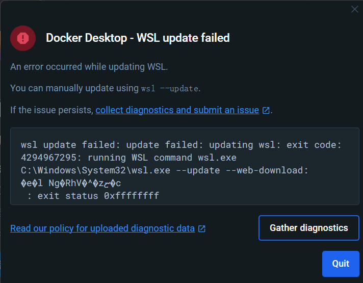

## win11部署docker

- 下载docker文件，进入官网需要魔法

  - **[Docker下载官网](https://docs.docker.com/desktop/install/windows-install/)**
- 启动window的 Hyper-V

  - 控制面板 --\> 程序 --\> 启动或关闭window功能
  - 找到Hyper-V并勾选
  - 还需勾选

    - Windows 虚拟机监控程序平台
    - 适用于Linux的Windows子系统
    - 虚拟机平台
- 安装Docker并重启电脑
- 电脑开机后显示协议，选择Accept --\> 默认勾选“Use recommended 。。。” --\> Finsh
- 没有账号需要创建并登录
- 等待Docker启动

  ‍
- # 报错

  - 登录时出新的报错
  - ​

    - 需要手动更新WSL
    - 终端执行`wsl --update`​
