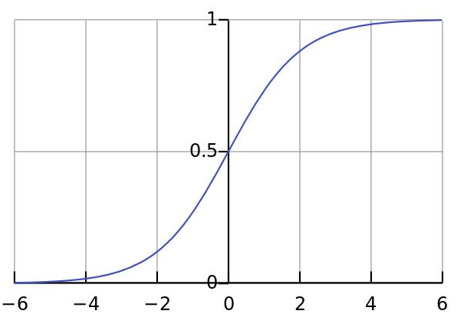

# 逻辑回归

# 基本概念

- **逻辑回归（Logistic Regression）**
- 利用 Sigmoid 函数 对 一个或多个自变量（特征值）与因变量（目标类别）之间 的关系进行建模的一种**分类模型**。
- 其本质是：**先通过线性组合计算一个“得分”，再通过 Sigmoid 函数将其映射为概率值**，从而实现对离散类别的预测。
- 虽然名称含“回归”，但它是用于解决**分类问题**（尤其是二分类）的经典算法，也可通过 One-vs-Rest 或 Softmax 扩展至多分类。

  > 📌核心思想：
  >
  > 1. 利用线性模型 $f(x)$​$=$​$w⊤x+b$，根据特征的重要性计算一个“线性得分”；
  > 2. 再使用 Sigmoid 函数将该得分映射为概率值 $p∈(0,1)$；
  > 3. 设置阈值（如 0.5）：若 $p$​$>$​$0.5$，则预测为正类（如 1）；否则预测为负类（如 0）。
  >
- **输入/输出：**

  - 输入：特征向量 $x$​$=$​$[x1,x2,...,xn]$
  - 输出：属于正类的概率值 $p∈(0,1)$，最终通过阈值转换为类别标签（如 0 或 1）

  > 将线性回归的输出作为逻辑回归的输入
  >
- **假设函数（Hypothesis Function，预测函数）** ：

  $$
  h(\mathbf{w}) = \sigma(\mathbf{w}^\top \mathbf{x} + b) = \frac{1}{1 + e^{-(\mathbf{w}^\top \mathbf{x} + b)}}
  $$

  > 其中 $σ(⋅)$ 是 Sigmoid 函数，它将线性输出压缩到 $(0,1)$ 区间，便于解释为“概率”。
  >
- 💡为什么用 Sigmoid？

  - 将无限范围的线性输出$（−∞ \ 到 +∞）$映射到 $[0,1]$​，符合概率定义；
  - 函数连续可导，便于梯度下降优化；
  - 在 $z$​$=$​$0$ 附近变化最敏感，利于区分边界样本。
- 损失函数

  ​`损失函数 = - 极大似然估计函数`​

  设计思想：预测值为 A、B 两个类别，真实类别所在的位置，概率值越大越好

# 数学模型

### sigmoid 函数

​`sigmoid`​ 函数（也称为S型函数，激活函数）

- 作用：把 $(-∞,+∞)$ 映射到 $(0,1)$，即：将预测值映射到 $(0,1)$

- 公式：

  $$
  f(x)=\cfrac{1}{1+e^{-x}}
  $$
- 数学性质：

  - 单调递增函数
  - 拐点在 $x=0,y=0.5$ 的位置
- 导函数公式：$f'(x)=f(x)(1-f(x))$

### 概率

- **概率**：事件发生的可能性
- **联合概率**：指两个或多个随机变量同时发生的概率
- **条件概率**：表示事件$A$在另一个事件$B$​已经发生条件下的发生概率，$P(A|B)$

### 极大似然估计

- 核心思想：选择一组模型参数，使得当前观测到的训练数据在该参数下出现的概率（即‘似然’）最大
- 作用：通过极大化概率事件，来估计最优参数

1. **观测数据：**

    $$
    \mathcal{D} = \{x^{(1)}, x^{(2)}, \ldots, x^{(m)}\}
    $$
2. **似然函数（Likelihood Function）**

    在给定参数 $θ$ 下，观测到当前数据集 $D$ 的联合概率：

    $$
    \mathcal{L}(\theta) = p(\mathcal{D} \mid \theta) = \prod_{i=1}^{m} p(x^{(i)} \mid \theta)
    $$

    【注】这里把 $θ$ 看作变量，数据 $D$ （即：产生的现象）是固定的

    由于连乘计算不便且易下溢，通常取对数

    对数似然函数（Log-Likelihood）（单调变换，不改变极值点）：

    $$
    \ell(\theta) = \log \mathcal{L}(\theta) = \sum_{i=1}^{m} \log p(x^{(i)} \mid \theta)
    $$
3. **极大似然估计的目标**

    找到使似然函数（或对数似然）最大的参数 $θ$：

    $$
    \hat{\theta}_{\text{MLE}} = \arg\max_{\theta} \mathcal{L}(\theta) = \arg\max_{\theta} \sum_{i=1}^{m} \log p(x^{(i)} \mid \theta)
    $$

- 【例子】估计硬币正面朝上的概率

  假设正面（记为 1）概率为$p$，反面（记为 0）概率为 $1-p$  

  - 独立抛了 10 次，观测结果：$\mathcal{D} = [1,1,0,1,0,1,1,1,0,1]$

  - 每次抛硬币服从**伯努利分布（Bernoulli）** ：$P(x|p)=p^x(1-p)^{1-x},x\in \{0,1\}$  

    似然函数：$\mathcal{L}(p) = P(\mathcal{D} \mid p) = \prod_{i=1}^{10} p^{x^{(i)}} (1-p)^{1-x^{(i)}}$  

    代入数据：$\mathcal{L}(p) = p^7 (1-p)^3$  

    对数似然函数：$\ell(p) = \log \mathcal{L}(p) = 7 \log p + 3 \log (1-p)$
  - **最大化对数似然**（求导并令导数为 $0$）：$\frac{d\ell(p)}{dp} = \frac{7}{p} - \frac{3}{1-p}=0$  

    解得：$\hat{p}_{\text{MLE}} = \cfrac{7}{10}=0.7$

‍
