# 集成学习

# 基本概念

- 什么是集成学习：一种通过<span data-type="text" style="background-color: var(--b3-card-info-background); color: var(--b3-card-info-color);">组合多个基学习器的预测结果</span>来提升整体性能的机器学习方法

  > 用同一个训练集训练多个弱学习器（基学习器），最终进行预测时，由多个学习器进行联合预测。而这一个整体，称为强学习器
  >

- 基本思想：“三个臭皮匠，顶个诸葛亮”——即弱学习器的集体决策往往优于单个强学习器。
- <span data-type="text" style="background-color: var(--b3-card-success-background); color: var(--b3-card-success-color);">集成学习分类</span>：

  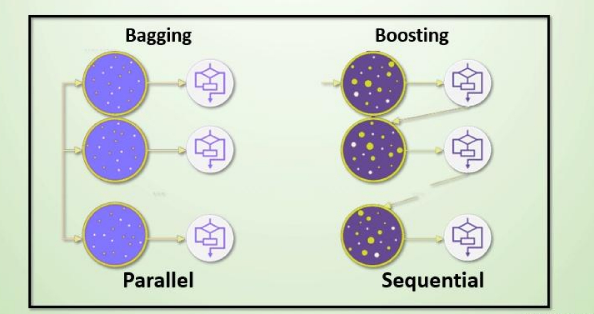​

  - Bagging：随机森林
  - Boosting：Adaboost、GBDT、XGBoost、LightGBM

### Bagging 思想

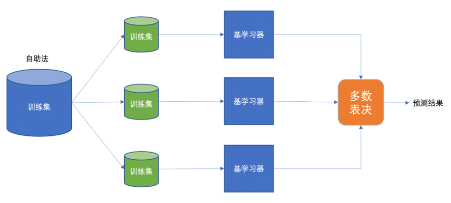​

- 有放回的抽样（Bootstrap 抽样）<span data-type="text" style="background-color: var(--b3-card-info-background); color: var(--b3-card-info-color);">产生不同的训练集</span>，从而训练不同的学习器
- 弱学习器可以<span data-type="text" style="background-color: var(--b3-card-info-background); color: var(--b3-card-info-color);">并行训练</span>
- 通过<span data-type="text" style="background-color: var(--b3-card-error-background); color: var(--b3-card-error-color);">平权投票</span>、多数表决的方式决定<span data-type="text" style="background-color: var(--b3-card-info-background); color: var(--b3-card-info-color);">预测结果</span>

【示例】把下面的圈和方块进行分类

> 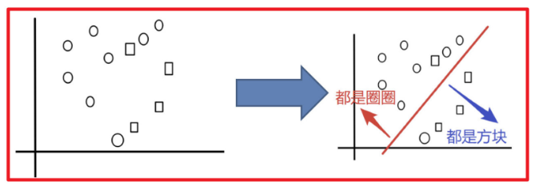
>
> 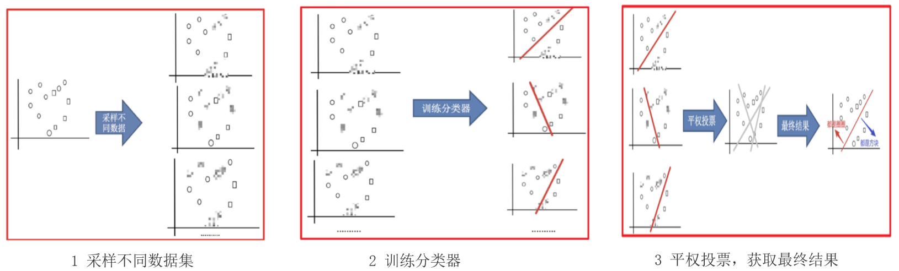

### Boosting 思想

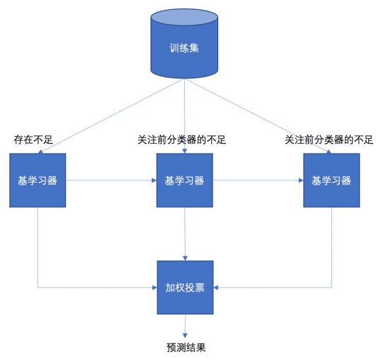​

- 每一个学习器重点关注<span data-type="text" style="background-color: var(--b3-card-info-background); color: var(--b3-card-info-color);">前一个学习器的不足</span>的地方进行训练
- <span data-type="text" style="background-color: var(--b3-card-info-background); color: var(--b3-card-info-color);">串行的训练方式</span>
- 通过<span data-type="text" style="background-color: var(--b3-card-error-background); color: var(--b3-card-error-color);">加权投票</span>的方式，得出预测结果

### bagging VS boosting

||bagging|boosting|
| ----------| ---------------------------------------------------------------------------------------------------------------------------------| ------------------------------------------------------------------------------------------------------------------------------------------------------------------------------------------------------------------------|
|数据采样|对数据进行<span data-type="text" style="background-color: var(--b3-card-error-background); color: var(--b3-card-error-color);">有放回的采样</span>训练|<span data-type="text" style="background-color: var(--b3-card-error-background); color: var(--b3-card-error-color);">全部样本</span>，根据<span data-type="text" style="background-color: var(--b3-card-info-background); color: var(--b3-card-info-color);">前一轮学习结果</span>调整数据的重要性|
|投票方式|所有学习器<span data-type="text" style="background-color: var(--b3-card-error-background); color: var(--b3-card-error-color);">平权投票</span>|对学习器进行<span data-type="text" style="background-color: var(--b3-card-error-background); color: var(--b3-card-error-color);">加权投票</span>|
|学习顺序|<span data-type="text" style="background-color: var(--b3-card-error-background); color: var(--b3-card-error-color);">并行</span>的，每个学习器之间没有依赖关系|<span data-type="text" style="background-color: var(--b3-card-error-background); color: var(--b3-card-error-color);">串行</span>，学习有先后顺序|

# 随机森林

- 定义：随机森林是一种基于 Bagging 思想的集成学习算法，通过构建多个决策树，并在训练每棵树时对样本和特征都进行随机采样，从而提升模型的泛化能力与稳定性。

  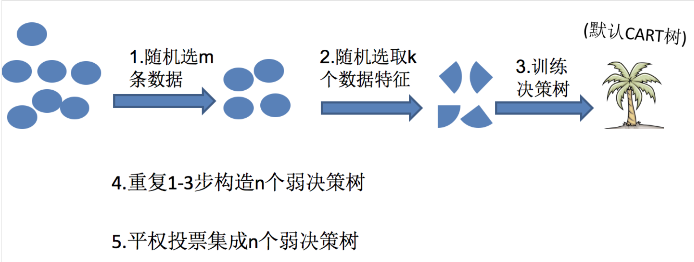

# Adaboost（自适应提升）

- 定义：Adaboost（Adaptive Boosting，自适应提升）是一种基于 Boosting 思想的继承学习算法。它通过迭代训练一些列弱分类器，并在每一轮中增加前一轮分类器错误样本的权重，同时降低正确分类样本的权重。最终将所有弱分类器按器准确率赋予不同权重，并进行加权投票，从而构建一个强分类器。
- 主要过程演示：

  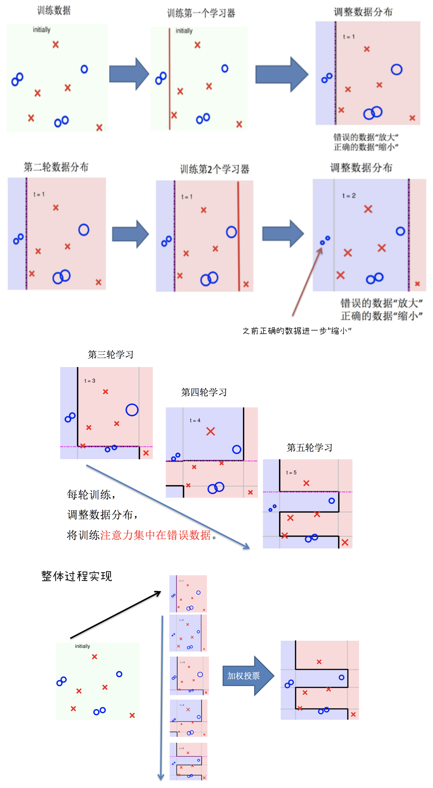
- 算法推导：

  1. 初始化<span data-type="text" style="background-color: var(--b3-card-info-background); color: var(--b3-card-info-color);">训练数据权重相等</span>，训练第 1 个学习器

      - 如果有 100 个样本，则每个样本的初始化权重为：$1/100$
      - 根据预测结果找一个错误率最小的分裂点，计算、更新：样本权重、模型权重

  2. 根据<span data-type="text" style="background-color: var(--b3-card-info-background); color: var(--b3-card-info-color);">新权重的样本集</span> **，** 训练第 2 个学习器

      - 根据预测结果找一个错误率最小的分裂点计算、<span data-type="text" style="background-color: var(--b3-card-error-background); color: var(--b3-card-error-color);">更新：样本权重、模型权重</span>

  3. <span data-type="text" style="background-color: var(--b3-card-info-background); color: var(--b3-card-info-color);">迭代训练</span>，在前一个学习器的基础上，根据新的样本权重训练当前学习器

      - 直到训练出 m 个弱学习器，并集成预测

  > - <span data-type="text" style="background-color: var(--b3-card-success-background); color: var(--b3-card-success-color);">m 个弱学习器集成预测公式</span>：**$H(x) = \text{sign}\left(\sum_{i=1}^{m} a_i h_i(x)\right)$**  
  >
  >   - $a$  为模型的权重，<span data-type="text" style="background-color: var(--b3-card-success-background); color: var(--b3-card-success-color);">输出结果大于 0 则归为正类，小于 0 则归为负类</span>
  > - <span data-type="text" style="background-color: var(--b3-card-success-background); color: var(--b3-card-success-color);">模型权重</span>计算公式：**$a_t = \frac{1}{2} \ln\left(\frac{1-\varepsilon_t}{\varepsilon_t}\right)$
  >
  >   - $a_t$  为模型权重
  >   - $ε_t$  表示第 t 个弱学习器的错误率
  >
  > - <span data-type="text" style="background-color: var(--b3-card-success-background); color: var(--b3-card-success-color);">样本权重</span>计算公式：
  >
  >   $$
     D_{t+1}(x) = \frac{D_t(x)}{Z_t} *
     \begin{cases} 
     e^{-a_t}, & \text{预测值 = 真实值} \\ 
     e^{a_t}, & \text{预测值} \neq \text{真实值}
     \end{cases}
     $$
  >
  >   - 其中 $Z_t$  为归一化值（所有样本权重总和）
  >   - $D_t(x)$  为样本权重
  >   - $a_t$  为模型权重
  >

# GBDT（梯度提升决策树）

- 定义：GBDT（Gradient Boosting Decision Tree，梯度提升树）是一种基于 **Boosting 思想** 的集成学习算法。它通过**串行训练一系列决策树**，每棵树学习的是**前一轮模型预测结果的**​**负梯度（即残差）** ，从而逐步减少整体损失函数。最终的强分类器（或回归器）是所有弱学习器（通常是浅层 CART 树）的加权累加和。

  核心思想：通过拟合负梯度来构建强学习器

  > 梯度提升树（Gradient Boosting Decision Tre）是提升树（Boosting Decision Tree）的一种改进算法
  >
  > 提升树核心思想：通过拟合残差来构建强学习器
  >
  > 残差：真实值 - 预测值
  >
  > 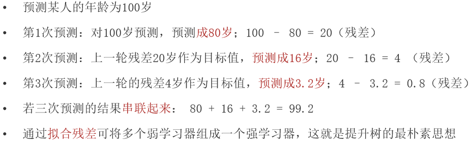
  >

- 梯度提升树的<span data-type="text" style="background-color: var(--b3-card-success-background); color: var(--b3-card-success-color);">构建流程</span>

  1. 初始化弱学习器（目标值的均值作为预测值）
  2. 迭代构建学习器，每一个学习器拟合上一个学习器的负梯度
  3. 直到达到指定的学习器个数
  4. 当输入未知样本时，将<span data-type="text" style="background-color: var(--b3-card-error-background); color: var(--b3-card-error-color);">所有弱学习器的输出结果组合起来作为强学习器的输出</span>
- **核心执行过程推导**

  1. 真实值为：$y$
  2. 前一轮迭代得到的强学习器：$f_{i-1}(x)$
  3. 损失函数为平方损失是：$L(y, f_{i-1}(x))$
  4. 本轮迭代的目标是找到一个弱学习器：$h_i(x)$
  5. 让本轮损失最小化：$L(y, f_i(x)) = L(y, f_{i-1}(x)) + h_i(x) = (y - f_{i-1}(x) - h_i(x))^2$
  6. 则要拟合的负梯度为：

      $$
      \frac{\partial L}{\partial f(x_i)} = f(x_i) - y_i
      \\
      -\left[\frac{\partial L}{\partial f(x_i)}\right] = y_i - f(x_i)
      $$

  所以 **GBDT 在回归中拟合的是残差**（即 $y_i−f_{i−1}(x_i)$ ），这就是为什么常说“GBDT 拟合残差”
- 【例子】

  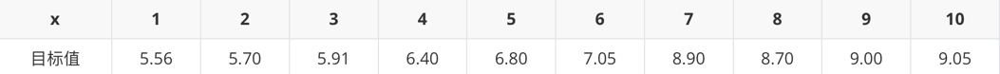

  1. 初始化弱学习器（CART 树）

      求当模型预测值为何值时，会使得第一个弱学习器的平方误差最小，即：求损失函数对 $f(x_i)$  的导数，并令导数为0。

      $$
      \frac{\partial L(y, f(x))}{\partial f(x_i)} 
      = (\cfrac{1}{2}\sum_{i=1}^n(y_i-f(x_i))^2)'_{f(x_i)}
      = \sum_{i=1}^{n}(y_i - f(x_i)) \cdot (-1) 
      \\
      = \sum_{i=1}^{n}(-y_i + f(x_i)) = 0 
      \qquad \qquad \qquad
      $$

      $得：f(x_i) = \cfrac{\sum_{i=1}^{n}y_i}{n} \quad ,由此得可知\ f(x_i) = \bar{y}$  

      故，若初始化弱学习器输出值为<u>目标值的均值</u>时，使得第一个弱学习器的平方误差最小

      ​
  2. 构建第1个弱学习器，根据负梯度的计算方法得到下表：

      |x|1|2|3|4|5|6|7|8|9|10|
      | :-------| :------| :------| :------| :------| :------| :------| :-----| :-----| :-----| :-----|
      |目标值|5.56|5.70|5.91|6.40|6.80|7.05|8.90|8.70|9.00|9.05|
      |预测值|7.31|7.31|7.31|7.31|7.31|7.31|7.31|7.31|7.31|7.31|
      |负梯度|-1.75|-1.61|-1.40|-0.91|-0.51|-0.26|1.59|1.39|1.69|1.74|

      当$1.5$为切分点：

      - 左子树（x≤1.5）：1个样本，负梯度为 -1.75

        均值：$c_{left} = -1.75$​
      - 右子树：9个样本，负梯度为 -1.61, -1.40, -0.91, -0.51, -0.26, 1.59, 1.39, 1.69

        均值：$c_{right} = \frac{(-1.61) + (-1.40) + (-0.91) + (-0.51) + (-0.26) + 1.59 + 1.39 + 1.69 + 1.74}{9} = 0.19$

      - 计算平方损失：$L_{split} = \sum_{x_i \in R_{left}} (r_i - c_{left})^2 + \sum_{x_i \in R_{right}} (r_i - c_{right})^2 = 15.72$

      各切分点平方损失对比：

      |切分点|1.5|2.5|3.5|4.5|5.5|6.5|7.5|8.5|9.5|
      | :---------| :------| :------| :-----| :-----| :-----| :-----| :-----| :------| :------|
      |平方损失|15.72|12.08|8.37|5.78|3.91|1.93|8.01|11.74|15.74|

      **结论：** 当 **6.5** 作为切分点时，平方损失最小（1.93），此时得到第1棵决策树

      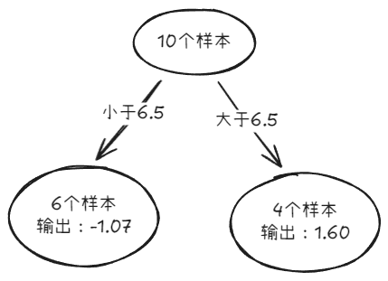​

      输出值：$f(x_i) = \bar{y}$，左子树：-1.07，右子树：1.60
  3. 构建第2个弱学习器

      数据表：

      |x|1|2|3|4|5|6|7|8|9|10|
      | :-------| :------| :------| :------| :------| :------| :------| :------| :------| :-----| :-----|
      |目标值|-1.75|-1.61|-1.40|-0.91|-0.51|-0.26|1.59|1.39|1.69|1.74|
      |预测值|-1.07|-1.07|-1.07|-1.07|-1.07|-1.07|1.60|1.60|1.60|1.60|
      |负梯度|-0.68|-0.54|-0.33|0.16|0.56|0.81|-0.01|-0.21|0.09|0.14|

      平方损失对比表：

      |切分点|1.5|2.5|3.5|4.5|5.5|6.5|7.5|8.5|9.5|
      | :---------| :-----| :-----| :-----| :-----| :-----| :-----| :-----| :----| :-----|
      |平方损失|1.42|1.00|0.79|1.13|1.66|1.93|1.93|1.9|1.91|

      **结论：** 当 **3.5** 作为切分点时，平方损失最小（0.79），此时得到第2棵决策树

      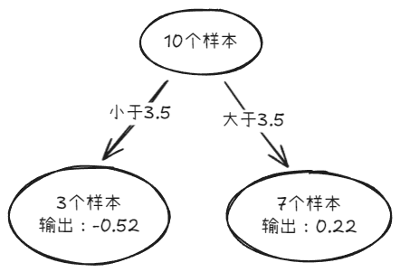​
  4. 构建第3个弱学习器

      **数据表：**

      |x|1|2|3|4|5|6|7|8|9|10|
      | :--| :------| :------| :------| :------| :-----| :-----| :------| :------| :------| :------|
      |**目标值**|-0.68|-0.54|-0.33|0.16|0.56|0.81|-0.01|-0.21|0.09|0.14|
      |**预测值**|-0.52|-0.52|-0.52|0.22|0.22|0.22|0.22|0.22|0.22|0.22|
      |**负梯度**|-0.16|-0.02|0.19|-0.06|0.34|0.59|-0.23|-0.43|-0.13|-0.08|

      **平方损失对比表：**

      |切分点|1.5|2.5|3.5|4.5|5.5|**6.5**|7.5|8.5|9.5|
      | :---------| :-----| :-----| :-----| :-----| :-----| :-| :-----| :-----| :-----|
      |平方损失|0.76|0.77|0.79|0.79|0.76|**0.47**|0.59|0.76|0.78|

      **结论：**  当 **6.5** 作为切分点时，平方损失最小（0.47），此时得到第3棵决策树。

      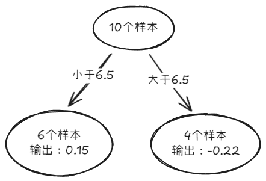​
  5. 构建最终弱学习器

      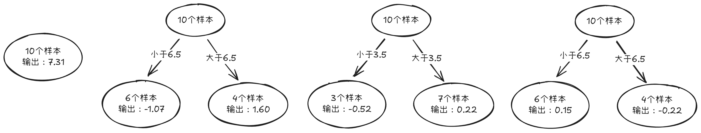

      |x|1|2|3|4|5|6|7|8|9|10|
      | :-------| :-----| :-----| :-----| :-----| :-----| :-----| :-----| :-----| :-----| :-----|
      |目标值|5.56|5.70|5.91|6.40|6.80|7.05|8.90|8.70|9.00|9.05|
      |预测值|5.87|5.87|5.87|6.61|6.61|6.61|8.91|8.91|8.91|8.91|

      以$x=6$为例，输入到最终学习器中的结果：$7.31+(-1.07)+0.22+0.15=6.61$  

      最终结果为其所有弱学习器的预测值相加

# XGBoost（Extreme Gradient Boosting）

- 定义：**XGBoost**（eXtreme Gradient Boosting，极端梯度提升），在GBDT基础上引入**正则化项**、**二阶泰勒展开**和**多项系统优化**
- 算法思想：

  XGBoost 是对GBDT的改进：

  1. 求解损失函数极值时使用泰勒二阶展开
  2. 在损失函数中加入了正则化项
  3. XGB 自创一个树节点分裂指标。这个分裂指标就是从损失函数推导出来的。XGB 分裂树时考虑到了树的复杂度。

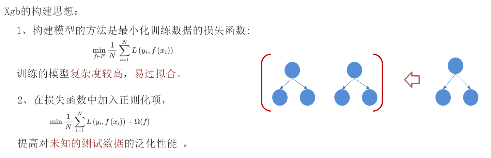

目标函数=损失函数+正则化项

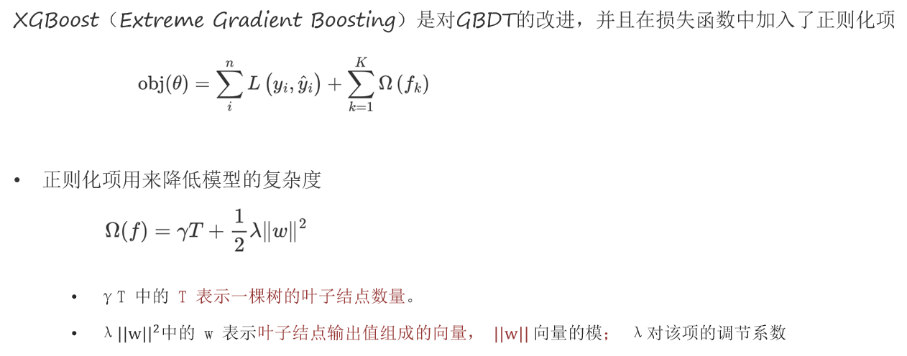

- 【例子】

  假设我们要预测一家人对电子游戏的喜好程度，考虑到年轻和年老相比，年轻更可能喜欢电子游戏，以及男性和女性相比，男性更喜欢电子游戏，故先根据年龄大小区分小孩和大人，然后再通过性别区分开是男是女，逐一给各人在电子游戏喜好程度上打分，如下图所示：

  

  就这样，训练出了2棵树tree1和tree2，类似之前gbdt的原理，两棵树的结论累加起来便是最终的结论。

  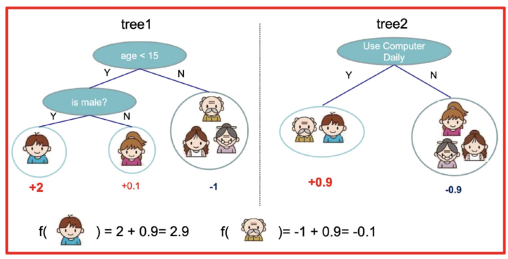

  - 小男孩的预测分数：2 + 0.9 = 2.9（两棵树中小孩所落到的结点的分数相加）
  - 同理，爷爷的预测分数：-1 + 0.9 = -0.1

  树 tree1的复杂度表示为：

  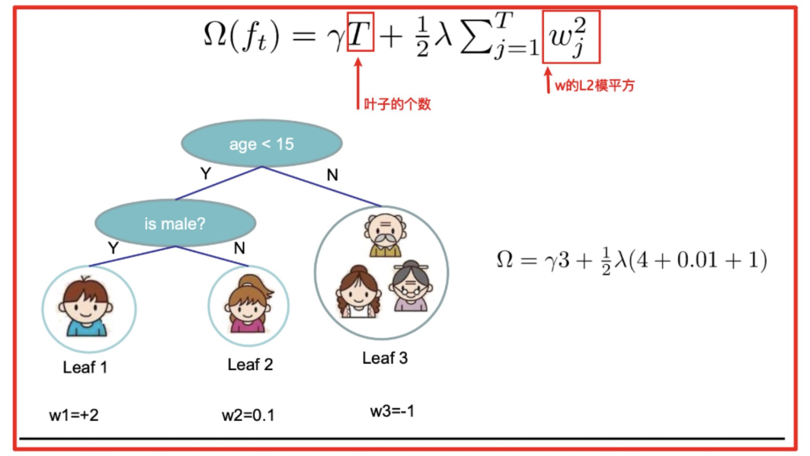

### XGBoost的树构建方法

该公式也叫做打分函数 (scoring function)，它可以从树的损失函数、树的复杂度两个角度来衡量一棵树的优劣。

这个公式，我们怎么用呢？

当我们构建树时，可以用来选择树的最佳划分点。

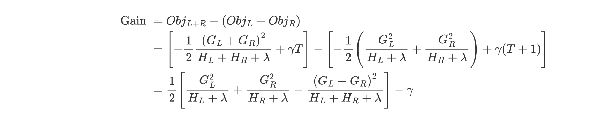

其过程如下：

1. 对树中的每个叶子结点尝试进行分裂
2. 计算分裂前 - 分裂后的分数：

    1. 如果gain > 0，则分裂之后树的损失更小，我们会考虑此次分裂
    2. 如果gain< 0，说明分裂后的分数比分裂前的分数大，此时不建议分裂
3. 当触发以下条件时停止分裂：

    1. 达到最大深度
    2. 叶子结点样本数量低于某个阈值
    3. 等等...

# 基础代码

### 随机森林

【案例】随机森林-泰坦尼克号乘客生存预测

```python
from sklearn.ensemble import RandomForestClassifier
rfc = RandomForestClassifier(
    n_estimators=100,            # 森林中决策树的数量
    criterion='gini',            # 单棵决策树划分质量的标准（'gini' 或 'entropy'）
    max_depth=None,              # 单棵树的最大深度（None 表示不限制）
    min_samples_split=2,         # 内部节点分裂所需的最小样本数
    min_samples_leaf=1,          # 叶节点所需的最小样本数
    max_features='sqrt',         # 寻找最佳划分时考虑的特征数量
    bootstrap=True,              # 是否使用有放回抽样（Bootstrap）构建每棵树
    oob_score=False,             # 是否使用袋外（OOB）样本估计泛化精度
    random_state=None,           # 随机种子（用于结果复现）
    n_jobs=None                  # 并行运行的作业数（None 表示单线程，-1 表示使用所有 CPU）
)
```

- ​**​`n_estimators`​**​：森林中决策树的总数。

  - 默认为 `100`​。树越多，模型越稳定，但计算开销越大。
  - 通常在一定范围内（如 50～500）增加该值可提升性能，但收益会逐渐饱和。
- ​**​`criterion`​**​：单棵决策树使用的划分标准。

  - ​`'gini'`​（默认）：基于基尼不纯度，计算快。
  - ​`'entropy'`​：基于信息增益（香农熵），对纯度更敏感，但略慢。
- ​**​`max_depth`​**​：单棵树的最大深度。

  - 若为 `None`​（默认），树会生长到完全纯净或满足其他停止条件，可能过拟合。
  - 设置较小值（如 5～15）有助于控制复杂度、提升泛化能力。
- ​**​`min_samples_split`​**​：**内部节点**分裂所需的最小样本数。

  - 默认为 `2`​。增大该值可抑制过拟合，防止模型对噪声敏感。
- ​**​`min_samples_leaf`​**​：每个**叶节点**必须包含的最小样本数。

  - 默认为 `1`​。增大该值（如 2～10）可使叶子更具代表性，提升模型鲁棒性。
- ​**​`max_features`​**​：每轮划分时考虑的特征子集大小。

  - ​`'sqrt'`​（默认）：取总特征数的平方根（适用于分类问题）。
  - ​`'log2'`​：取 log₂(特征总数)。
  - ​`None`​：使用所有特征
  - 整数：指定具体数量；浮点数：表示比例。
  - 限制特征数量可增加树之间的多样性，是随机森林“随机性”的关键来源。
- ​**​`bootstrap`​**​：是否对每棵树使用 Bootstrap 抽样（有放回采样）。

  - 默认为 `True`​。若设为 `False`​，则每棵树使用全部训练样本，失去部分集成优势。
- ​**​`oob_score`​**​：是否使用袋外（Out-Of-Bag, OOB）样本来评估模型。

  - 默认为 `False`​。启用后可通过未参与某棵树训练的样本估算泛化误差，无需单独验证集。
- ​**​`random_state`​**​：控制整体随机性的种子。

  - 设为整数（如 `42`​）可确保结果可复现；`None`​ 则每次运行结果不同。
- ​**​`n_jobs`​**​：并行运行的作业数。

  - ​`None`​：单线程；`-1`​：使用所有 CPU 核心加速训练（适合大数据集）。

### Adaboost

【案例】AdaBoost-葡萄酒的分类

```python
from sklearn.ensemble import AdaBoostClassifier

ada = AdaBoostClassifier(
    estimator=None,              # 基础弱分类器（默认为 DecisionTreeClassifier(max_depth=1)）
    n_estimators=50,             # 弱分类器的数量
    learning_rate=1.0,           # 学习率（收缩每个弱分类器贡献的权重）
    algorithm='SAMME.R',         # 算法变体（'SAMME' 或 'SAMME.R'）
    random_state=None            # 随机种子（用于结果复现）
)
```

- ​**​`estimator`​**​：用作基础学习器的弱分类器。

  - 默认为 `None`​，此时自动使用 **深度为 1 的决策树（Decision Stump）** 。
  - 可替换为任意支持 `sample_weight`​ 的分类器（如 `LogisticRegression`​ 需注意不支持加权，不可用）。
  - ⚠️ 若提供自定义估计器，必须实现 `fit(X, y, sample_weight)`​ 方法。
- ​**​`n_estimators`​**​：集成中弱分类器的总数。

  - 默认为 `50`​。增加数量通常能提升性能，但也会增加训练时间和过拟合风险（尤其在噪声数据上）。
  - 实践中常在 `50～500`​ 范围内调参，配合 `learning_rate`​ 使用。
- ​**​`learning_rate`​**​：收缩每个弱分类器权重的系数。

  - 默认为 `1.0`​。若设为小于 1 的值（如 `0.1`​），需配合更大的 `n_estimators`​（类似梯度提升中的“**学习率**”思想）。
  - 公式：最终分类器权重 αt←learning\_rate×αtαt←learning\_rate×αt 。
  - 较小的学习率 + 更多的估计器 → 更平滑的优化路径，可能提升泛化能力。
- ​**​`algorithm`​**​：AdaBoost 的具体实现算法。

  - ​`'SAMME.R'`​（默认）：  
    使用**概率输出**进行更新，收敛更快、性能通常更好（要求基分类器支持 `predict_proba`​）。
  - ​`'SAMME'`​：  
    原始 AdaBoost 算法，基于**类别预测**更新权重，适用于不支持概率输出的分类器。
  - 📌 若使用默认的决策树桩（支持 `predict_proba`​），推荐保持 `'SAMME.R'`​。
- ​**​`random_state`​**​：控制随机性的种子。

  - 仅当 `estimator`​ 本身具有随机性（如决策树设置了 `random_state`​）时才影响结果。
  - 设为整数（如 `42`​）可确保实验可复现。

### GBDT

【案例】GBDT-泰坦尼克号乘客生存预测

```python
from sklearn.ensemble import GradientBoostingClassifier, GradientBoostingRegressor

# 分类任务
gbdt_clf = GradientBoostingClassifier(
    n_estimators=100,           # 弱学习器（决策树）的数量
    learning_rate=0.1,          # 学习率（收缩步长）
    max_depth=3,                # 单棵树的最大深度
    min_samples_split=2,        # 内部节点分裂所需的最小样本数
    min_samples_leaf=1,         # 叶节点所需的最小样本数
    max_features=None,          # 每次划分考虑的特征数量
    subsample=1.0,              # 用于训练每棵树的样本比例（<1.0 可防止过拟合）
    criterion='friedman_mse',   # 划分质量标准（通常不用修改）
    random_state=None,          # 随机种子
    verbose=0                   # 是否输出训练过程信息
)

# 回归任务（参数基本相同）
gbdt_reg = GradientBoostingRegressor(...)

'''调参重点'''
learning_rate + n_estimators + max_depth + subsample
```

- ​**​`n_estimators`​**​：弱学习器（通常是浅层决策树）的总数。

  - 默认为 `100`​。增加数量可提升性能，但需配合较小的 `learning_rate`​。
  - 过多可能导致过拟合或训练时间剧增。
- ​**​`learning_rate`​**​（学习率 / shrinkage）：

  - 默认为 `0.1`​。控制每棵树对最终结果的贡献程度。
  - 较小的学习率（如 `0.01`​～`0.1`​）配合较大的 `n_estimators`​（如 500～2000）通常效果更好，称为“**正则化提升**”。
- ​**​`max_depth`​**​：

  - 默认为 `3`​（浅层树）。这是 GBDT 控制模型复杂度的关键。
  - 通常设置为 `3～8`​。深度过大易过拟合；过小则欠拟合。
- ​**​`min_samples_split`​**​  **/**  **​`min_samples_leaf`​**​：

  - 与随机森林类似，用于限制树的生长，增强泛化能力。
  - 增大这些值可减少过拟合，尤其在小数据集上有效。
- ​**​`max_features`​**​：

  - 默认为 `None`​（即使用所有特征）。
  - 可设为 `'sqrt'`​、`'log2'`​ 或浮点数（如 `0.8`​ 表示使用 80% 的特征），引入随机性以提升泛化。
- ​**​`subsample`​**​（行采样率）：

  - 默认为 `1.0`​（使用全部样本）。
  - 若设为 `<1.0`​（如 `0.8`​），则每棵树只用部分样本训练（**随机梯度提升**），可显著降低过拟合风险。
  - 类似于随机森林中的 Bootstrap，但这里是**无放回抽样**。
- ​**​`criterion`​**​：

  - 默认 `'friedman_mse'`​（Friedman 提出的改进 MSE，兼顾划分质量和计算效率）。
  - 一般无需修改。
- ​**​`random_state`​**​：

  - 当 `subsample < 1.0`​ 或 `max_features < n_features`​ 时，结果具有随机性，可通过此参数复现。

### XGBoost

【案例】XGBoost-红酒品质的分类

```python
pip install xgboost  # 需要手动安装XGB，sklearn中没有集成
```

```python
from xgboost import XGBClassifier, XGBRegressor

xgb = XGBClassifier(
    n_estimators=100,           # 树的数量
    learning_rate=0.1,          # 学习率（别名：eta）
    max_depth=6,                # 树的最大深度
    subsample=1.0,              # 训练每棵树时的样本采样比例
    colsample_bytree=1.0,       # 每棵树使用的特征比例
    gamma=0,                    # 节点分裂所需的最小损失减少值（越大越保守）
    reg_alpha=0,                # L1 正则化项权重（控制叶子权重稀疏性）
    reg_lambda=1,               # L2 正则化项权重（默认为1，平滑叶子权重）
    objective='binary:logistic',# 目标函数（自动根据任务推断，也可显式指定）
    eval_metric='logloss',      # 评估指标
    random_state=None,          # 随机种子
    n_jobs=-1,                  # 并行线程数（-1 表示使用所有 CPU）
    verbosity=1                 # 日志输出级别
)
```

- ​**​`n_estimators`​**​（别名 `num_round`​）：

  - 同 GBDT，默认 `100`​。XGBoost 支持早停（early stopping），可设较大值配合验证集防止过拟合。
- ​**​`learning_rate`​**​ **（别名** **​`eta`​**​ **）** ：

  - 默认 `0.1`​。作用同 GBDT，建议调小（如 `0.01`​～`0.3`​）配合更多树。
- ​**​`max_depth`​**​：

  - 默认 `6`​（比 sklearn GBDT 更深）。控制树复杂度，典型值 `3～10`​。
  - XGBoost 使用**精确贪心算法**或**近似分位数**进行分裂，对深度更鲁棒。
- ​**​`subsample`​**​：

  - 默认 `1.0`​。设为 `0.6`​～`0.8`​ 可提升泛化能力。
- ​**​`colsample_bytree`​**​：

  - 默认 `1.0`​。表示每棵树随机选择多少比例的特征（类似 `max_features`​）。
  - 常设为 `0.6`​～`0.9`​，增加多样性，防过拟合。
- ​**​`gamma`​**​ **（最小损失减少阈值）** ：

  - 默认 `0`​。只有当分裂带来的损失减少 \> `gamma`​ 时才允许分裂。
  - 值越大，树越保守（剪枝更强）。
- ​**​`reg_alpha`​**​ **（L1 正则）**   **&amp;**   **​`reg_lambda`​**​ **（L2 正则）** ：

  - 控制叶子权重（leaf score）的复杂度。
  - ​`reg_lambda=1`​ 是默认值，提供轻微平滑；`reg_alpha>0`​ 可产生稀疏模型（特征选择效果）。
- ​**​`objective`​**​：

  - 自动根据任务类型推断（如二分类用 `binary:logistic`​，多分类用 `multi:softprob`​，线性回归用 `reg:linear`​，逻辑回归用 `reg:logistic`​，平方误差用 `reg:squarederror`​）。
  - 也可自定义目标函数（高级用法）。
- ​**​`eval_metric`​**​：

  - 如 `'logloss'`​、`'auc'`​、`'rmse'`​ 等，用于监控训练过程。
- ​**​`n_jobs`​**​：

  - XGBoost 原生支持多线程，设为 `-1`​ 可大幅加速训练。

【注】其中别名为 原生API参数，而 xgboost 可直接使用 sklearn API 的参数

‍
