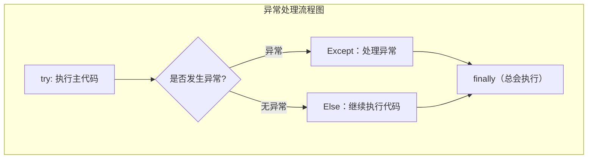

# Python 异常处理：try-except 语法与最佳实践

> **学习目标**：掌握 Python 异常捕获、自定义异常、资源清理的标准写法。

## 基础概念

**什么是异常：**
- **异常**：程序**运行时**发生的错误，会中断正常执行流程（可捕获处理）
- **语法错误**：代码书写错误（编译阶段报错，**无法捕获**）
- **异常机制**：优雅处理错误，保证程序不崩溃，提升稳定性

**语法错误 vs 运行时异常**

| 类型       | 发生时机   | 可恢复性 | 示例                     |
| ---------- | ---------- | -------- | ------------------------ |
| 语法错误   | 代码解析时 | 否       | `print("hello`（缺括号） |
| 运行时异常 | 程序运行时 | 是       | `1/0`、打开不存在文件    |

**异常处理方式：**

1. 不处理：交由程序默认处理，将异常信息、产生原因、位置打印到控制台，并终止程序
2. 捕获异常：通过 `try-except` 手动处理，处理后程序继续向下执行

## 标准异常体系

所有异常根类：`BaseException`

**开发常用基类**：`Exception`（所有业务异常的父类）

```python
# 异常层次结构示例
BaseException
├── SystemExit          # 解释器请求退出
├── KeyboardInterrupt   # 用户中断执行(通常是Ctrl+C)
├── GeneratorExit       # 生成器发生异常通知退出
└── Exception           # 常规异常基类
    ├── ArithmeticError # 算术运算相关异常
    │   └── ZeroDivisionError  # 除数为 0
    ├── LookupError     # 索引/键查找异常
    │   ├── IndexError  # 列表 / 元组索引越界
    │   └── KeyError    # 字典键不存在
    ├── OSError         # 操作系统相关异常
    │   ├── FileNotFoundError  # 文件不存在
    │   └── PermissionError    # 权限不足
    ├── IndentationError
    │   └── SyntaxError  # 语法错误
    ├── ValueError      # 类型正确，但值不合法
    ├── AttributeError  # 访问对象不存在的属性 / 方法
    ├── TypeError       # 类型操作错误
    └── NameError       # 使用未定义变量
```

## 核心语法：try-except-else-finally

### 执行流程



1. 执行 `try` 代码块
2. 无异常：跳过 `except`，执行 `else`
3. 有异常：匹配 `except`，执行异常处理
4. **无论是否异常，最终一定执行 `finally`**（用于释放资源）

### 5 种标准写法

```python
# 1. 通用捕获（推荐：捕获所有业务异常）
try:
    风险代码
except Exception as ex:
    异常处理

# 2. 捕获指定异常
try:
    1 / 0
except ZeroDivisionError:
    print("除数不能为0")

# 3. 统一捕获多个异常
try:
    代码
except (IndexError, KeyError):
    print("索引/键错误")

# 4. 分别处理多个异常（子类在前，父类在后！）
try:
    代码
except ZeroDivisionError:
    print("除零错误")
except ValueError:
    print("值错误")
except Exception as e:
    print("其他异常")

# 5. 完整语法（最常用）
try:
    风险代码
except Exception as e:
    异常处理
else:
    无异常时执行
finally:
    必须执行（关闭文件/数据库/网络连接）
```

## raise 主动抛异常

用于**手动触发异常**（参数校验、业务规则校验）。

### 基础用法

```python
def calculate_sqrt(x):
    if x < 0:
        raise ValueError("输入值不能为负数")
    return x ** 0.5
```

### 自定义异常

必须继承 `Exception`，支持传递错误信息：

```python
class CouponError(Exception):
    pass

try:
    raise CouponError("优惠券已过期！")
except CouponError as e:
    print("异常信息：", e)
```

## 实战案例

### 案例 1：安全文件操作

```python
f = None
try:
    f = open("apple.txt", "w", encoding="utf-8")
    f.write("测试")
except Exception as e:
    print("文件操作失败：", e)
finally:
    if f:
        f.close()
        print("文件已关闭")
```

### 案例 2：优化猜数字游戏

```python
import random
target = random.randint(1, 100)

while True:
    try:
        num = int(input("请猜数字(1-100)："))
        if num > target:
            print("猜大了")
        elif num < target:
            print("猜小了")
        else:
            print("猜对了！")
            break
    except ValueError:
        print("输入错误！请输入整数！")
```

## 最佳实践

1. **禁止使用裸 `except:`** — 会捕获系统异常，导致无法终止程序
2. **捕获顺序**：子类异常在前，`Exception` 兜底在后
3. **`finally` 唯一用途**：释放资源（文件、数据库、网络）
4. **自定义异常**：仅用于业务场景，优先使用内置异常
5. **异常信息**：必须保留，方便调试，不要只打印固定文字

## 相关链接

- [[Python 文件与系统操作]] — 文件操作中的异常处理
