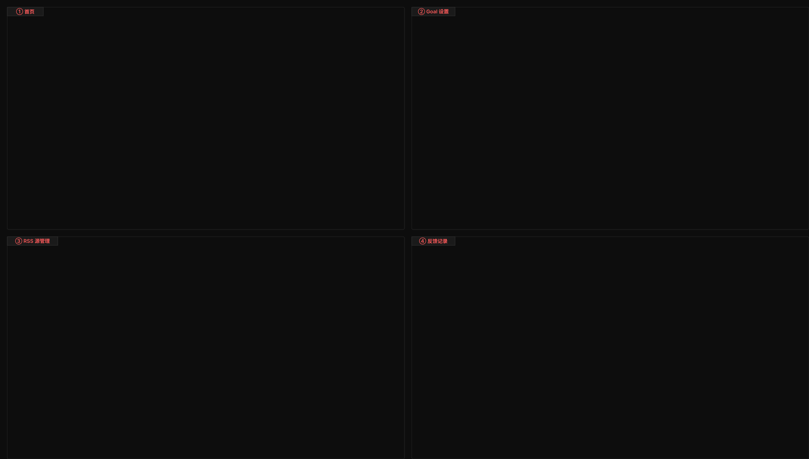

---
tags:
  - 作坊
  - Agent
  - LangGraph
  - DeepSeek
  - RSS
  - 信息聚合
---

# FeedLens：基于 LangGraph + DeepSeek 的多 Agent 智能信息简报系统

> 一个「AI 帮你刷信息流」的个人工具——从 RSS 订阅出发，自动采集 → 去重排序 → 生成简报 → 推送，全程由多个 LLM Agent 自主协作完成。技术栈：LangGraph + DeepSeek + ChromaDB + MCP + Streamlit。

## 为什么要做这个项目？

每天打开 36氪、少数派、阮一峰周刊……几十条更新，真正值得看的可能只有 3-5 条。FeedLens 的目标很简单：**让 AI 替你筛选信息，每天只给你最重要的 10 条，附带摘要和分类**。

它不是简单的 RSS 阅读器——它是一个完整的 AI Agent 管线：

- **采集**：自动拉取 RSS + 搜索补充
- **去重排序**：向量去重 + 多因子偏好排序（相关度、时效性、用户偏好、重要性）
- **简报生成**：结构化 JSON 简报 + Markdown 渲染 + 质量审查
- **推送**：MCP 协议推送，支持定时/手动/重大事件破例
- **反馈学习**：用户 like/dislike → 更新偏好向量 → 下次排序更精准

---

## 架构总览

```
用户 Goal 设置
     ↓
┌─────────────────────────────────────────────────┐
│              Main Agent (StateGraph)              │
│  understand_intent → planner → router → ...      │
│       ↑                                       ↓  │
│       └─────── ReAct 循环（最多 3 轮）─────────┘  │
│                                                   │
│  ┌──────────┐  ┌──────────┐  ┌──────────┐       │
│  │Collection │→ │ Ranking  │→ │ Briefing │       │
│  │  Agent    │  │  Agent   │  │  Agent   │       │
│  │           │  │          │  │          │       │
│  │ fetch_rss │  │deduplicate│  │generate  │       │
│  │ search_web│  │ rank_items│  │quality   │       │
│  │ normalize │  │          │  │ check    │       │
│  └──────────┘  └──────────┘  └──────────┘       │
└─────────────────────────────────────────────────┘
     ↓                     ↓                ↓
  RSS API            ChromaDB            MCP Push
  Bing Search        SQLite              Streamlit
```

**核心设计**：Main Agent 不是硬编码的流水线，而是通过 **LLM 驱动的 Planner + Router** 自主决策。Planner 分析当前状态（采集量、排序质量、简报质量），决定下一步调度哪个子 Agent；Router 根据执行结果判断是重试还是进入下一阶段。整个流程支持最多 3 轮 ReAct 循环，采集不足会自动触发搜索补充，排序不佳会放宽门槛重新排序。

---

## 技术选型

| 技术决策 | 选定方案 | 为什么选这个 |
|---------|---------|-------------|
| LLM | DeepSeek (deepseek-v4-flash) | 国内直连，成本低，支持 Function Calling |
| Agent 框架 | LangGraph StateGraph | 条件边动态路由，状态跨节点共享 |
| Agent 模式 | ReAct 循环 + LLM Planner | 自主编排，应对采集不足/质量不达标等异常 |
| Embedding | BAAI/bge-small-zh-v1.5 | 本地离线，中文效果好，CPU 可跑 |
| 向量库 | ChromaDB（持久化） | 轻量级，无需 Docker，支持本地文件持久化 |
| 关系数据库 | SQLite（WAL 模式） | 零配置，11 张表覆盖用户/源/条目/简报/日志/反馈 |
| 工具调用 | OpenAI Function Calling | 子 Agent 内部 ReAct 循环，LLM 自主选工具 |
| 跨进程通信 | MCP (SSE + stdio) | 搜索服务独立进程，推送走标准协议 |
| UI | Streamlit | 极简，6 个页面覆盖完整操作流程 |
| 调度 | APScheduler | 每日定时 + 重大事件破例推送 |

---

## 横向对比：FeedLens vs 其他 Agent 简报系统

市面上已有多款 AI 信息简报系统，主流的有 **Horizon**（5.9K⭐，AI 打分+双语日报）、**rss-llm-digest**（LangGraph 编排，Telegram 推送）、**Coze + RSS 方案**（低代码搭建）等。下表从架构维度做对比：

| 维度 | 典型系统（Horizon/rss-llm-digest/Coze） | FeedLens |
|------|----------------------------------------|----------|
| **编排方式** | 固定流水线（采集→打分→摘要→推送），顺序执行 | **LLM 自主编排**，Planner 根据运行状态动态决策，支持跳过/重试/扩展 |
| **Agent 粒度** | 单层 Agent 或简单 tool calling | **两层 Agent**：主 Agent 编排 + 子 Agent 各自 ReAct 循环，工具权限隔离 |
| **去重机制** | 标题匹配 / URL 匹配 / 简单相似度 | **三层向量去重漏斗**：跨批次预过滤(0.92) → 批次内(0.88) → LLM 裁决(0.70~0.88) |
| **排序逻辑** | 单一排序（时间/热度/AI 打分） | **多因子加权**，冷启动/偏好双模式动态切换，偏好权重随反馈累积自动提升 |
| **记忆系统** | 无状态 / 仅存储摘要结果 | **双层记忆**：情节记忆(SQLite) + 长期语义记忆(ChromaDB)，Planner 可检索历史经验 |
| **反馈闭环** | 无反馈 / 简单星级 | **向量化偏好学习**：like/dislike 分离向量，排序时余弦匹配，反馈数≥3 自动切换权重 |
| **异常处理** | 报错退出 / 简单重试 | **6 层防御**：错误隔离 + 执行栅栏 + 模型回退 + 死循环检测 + 硬兜底 + JSON 三层容错 |
| **LLM 角色** | 仅用于摘要生成 | **全链路 LLM 参与**：意图理解 → 决策编排 → 路由判断 → 质量审查 → 记忆摘要 → 偏好学习 |
| **扩展性** | 增删 RSS 源 | RSS 源 + 搜索补充 + 元数据增强 + 可替换策略 Hook + MCP 扩展 |

### 差异化亮点详解

**1. "不是执行固定脚本，而是自主决策"**

大多数系统（包括 Horizon、rss-llm-digest）的本质是：采集 → 打分 → 摘要 → 推送，即使用了 LangGraph 也只是把一个确定性的 DAG 画出来。FeedLens 的 Planner 是真正的 **LLM 决策节点**——它会问自己"采集够吗？排序质量好吗？"，不够就补搜索，不好就放宽门槛重新排，不行就跳过直接推送。这不是流程编排，是 **自主问题解决**。

**2. "记忆让系统越用越聪明"**

Horizon 等系统每次执行都是"全新的一天"，昨天的结果对今天毫无影响。FeedLens 的记忆系统让 Planner 检索"上次采集了 62 条但 top_score 只有 0.15"这样的历史经验，从而在今天做出更好的决策。用户反馈也通过向量化的偏好学习持续影响排序权重——用的越久越懂你。

**3. "向量化去重不是简单的相似度判断"**

大多数系统用 URL 匹配或标题相似度去重，FeedLens 的三层向量漏斗可以识别出"标题不同但内容高度相似"的跨源重复，并且对 0.70~0.88 的模糊区间引入 LLM 做语义级别裁决。跨批次预过滤还保证了"昨天推送过的，今天不会再推"。

**4. "从工具到执行的全链路健壮性"**

Coze 这类低代码方案省心但黑盒；Horizon 开源但容错有限。FeedLens 从 LLM 调用（模型回退链）、子 Agent 执行（错误隔离不阻塞管线）、并发控制（执行栅栏）、JSON 解析（三层容错）到 ReAct 循环（死循环检测 + 硬兜底）——6 层防御，适合作为"丢在那自己跑"的长期个人工具。

**5. "冷启动 → 偏好模式的自然过渡"**

排序系统最尴尬的是：新用户没有反馈数据，排不准；老用户反馈多了，权重又没跟上。FeedLens 的冷启动/偏好双模式解决了这个问题——反馈不足时偏好权重仅 0.10，靠语义相似度和时效性撑场面；反馈积累到 3 条后自动切换，偏好权重跃升到 0.40。过渡完全自动，用户无感。

---

## 核心亮点

### 1. LLM 驱动的自主编排（非固定流水线）

传统的信息聚合系统通常是固定的采集→排序→简报流水线。FeedLens 的不同在于：**Planner 是 LLM，它根据当前运行状态实时决策下一步**。

```
Planner 的 7 个决策场景：
├── 采集条数 < 3 且未补充搜索 → search_expand
├── 排序 top_score < 0.3 → rerank 或跳过
├── 简报条目 < 10 但采集足够 → expand_threshold（放宽排序门槛）
├── 简报条目 < 10 且采集不足 → 先 search_expand 补充采集
├── 简报质量 < 0.7 → retry_briefing 或 skip
├── react_cycle >= 2 → 优先收敛，跳过非必须步骤
└── top_score > 0.85 且重要性高 → push_immediate（破例推送）
```

Planner 还会检索**历史执行经验**（SQLite 近 7 天记录 + ChromaDB 语义相似场景），让决策越来越准。LLM 调用失败时有**三层降级**：规则回退 → 默认三板斧 → 强制收敛。

### 2. 子 Agent 也是 ReAct 循环

每个子 Agent（Collection / Ranking / Briefing）内部也是 ReAct 循环：

```
LLM Thought → function_call → Observation → Thought → ... → finish_task
```

- **Collection Agent**：5 个工具（fetch_rss / search_web / enrich_metadata / normalize_items / finish_task）
- **Ranking Agent**：3 个工具（deduplicate / rank_items / finish_task）
- **Briefing Agent**：3 个工具（generate_briefing / quality_check / finish_task）

每个子 Agent 只能调用自己阶段的工具，不能越权。比如 Briefing Agent 调不了 fetch_rss，这从工具 schema 层面做了权限隔离。

### 3. 三层去重 + 多因子排序

**去重不是简单的 title 匹配**，而是一个三层漏斗：

| 层 | 机制 | 阈值 | 说明 |
|---|------|------|------|
| 第 1 层 | 跨批次预过滤 | cosine ≥ 0.92 | 与历史条目向量比对，高相似直接丢弃 |
| 第 2 层 | 批次内向量去重 | cosine ≥ 0.88 | 同一批次内相似条目自动判重 |
| 第 3 层 | LLM 裁决 | 0.70 ~ 0.88 | 中间区间由 LLM 判断是否重复 |

**排序是多因子加权**，且支持**冷启动/有反馈**两套权重动态切换：

| 因子 | 冷启动权重 | 有反馈权重 | 说明 |
|------|:--------:|:--------:|------|
| similarity | 0.40 | 0.30 | 与用户 Goal 的语义相似度 |
| recency | 0.25 | 0.20 | 时间衰减（半衰期 24h） |
| preference | 0.10 | 0.40 | 用户偏好匹配（反馈越多权重越高） |
| importance | 0.25 | 0.10 | LLM 评估的重要性 |

> 当反馈数 ≥ 3 条时自动从冷启动切换到偏好模式，用户偏好权重从 0.10 跃升到 0.40。

### 4. 双层记忆系统

FeedLens 是「每天一次独立管线执行」的定时系统，不存在多轮对话上下文。因此设计了两层记忆：

| 记忆层 | 存储 | 作用 |
|--------|------|------|
| 情节记忆 | SQLite execution_logs | Planner 检索近 7 天执行记录，知道"上次采集 62 条、排序 top 0.15、简报质量 0.6" |
| 长期记忆 | ChromaDB domain_knowledge | 每次执行后 LLM 摘要写入，语义检索历史类似场景的处理经验 |

这层记忆让 Planner 的决策不再是「每次都从零开始」，而是能回顾历史、借鉴经验。

### 5. 反馈驱动的偏好学习

用户可以对每条简报条目点 like / dislike / irrelevant：

- 反馈直接更新 ChromaDB 中的 `user_preference` 集合（v_like / v_dislike 正负分离）
- 排序时用 cosine 相似度计算条目与偏好向量的匹配度
- 反馈数 ≥ 3 自动从冷启动切换到偏好模式（preference 权重 0.10 → 0.40）
- 反馈有时间衰减，过期偏好自动清理

### 6. 健壮性设计

- **错误隔离**：`run_with_isolation()` 确保单个子 Agent 失败不阻塞整条管线
- **执行栅栏**：`ExecutionFence` 防止定时触发和手动触发并发写偏好向量
- **模型回退**：主 LLM 不可用时自动切换到备用 Provider
- **死循环检测**：连续 3 次路由到同一节点 → 强制结束
- **硬兜底**：超过最大轮数（默认 5）→ 强制收敛推送
- **LLM JSON 解析三层容错**：直接解析 → regex 清洗 → 逐字段提取

### 7. MCP 跨进程工具调用

两个独立的 MCP Server：

- **Search Server**（SSE :8100）：Bing 搜索，RSS 采集不足时补充。失败降级为模拟数据
- **Push Server**（stdio）：简报写入 JSONL 通知队列，Streamlit 前端读取展示

这种设计展示了「Agent 工具不一定在进程内」——搜索和推送是独立服务，通过标准 MCP 协议调用。

---

## 数据流全景

```
1. understand_intent
   ├── 识别触发类型（daily_briefing / manual / breaking_news）
   ├── LLM 提取结构化 Goal（topics, keywords, preferred_sources）
   └── 生成 goal_embedding（bge-small-zh-v1.5）

2. planner（LLM 自主编排）
   ├── 构建上下文：采集量 + 排序质量 + 简报质量 + 历史经验
   ├── LLM 决策 → sub_agent_plan: [{agent, params}, ...]
   └── 失败时回退到标准三板斧

3. router（LLM + 规则混合路由）
   ├── 正常流程：规则路由（确定性，无需 LLM）
   ├── 需重试/重编排：LLM 路由
   └── 防死循环 + 硬兜底

4. invoke_sub_agent（顺序执行子 Agent）
   ├── Collection: fetch_rss → search_web(不足时) → normalize
   ├── Ranking: deduplicate → rank_items
   └── Briefing: generate_briefing → quality_check

5. observe_results（质量评估）
   ├── 采集量 / 排序分 / 简报质量 / 条目数 → needs_retry?
   └── 预筛过严检测（采集充足但排序后极少 → expand_threshold）

6. coordinator_reflect（综合审查）
   ├── 完整性 + 去重 + 可追溯性 + 矛盾检测
   └── overall_pass? → push_notification / planner（重做）

7. push_notification
   ├── 优先推送 Markdown 简报
   └── 降级：ranked_items 摘要

8. update_memory
   ├── 写入 execution_logs（SQLite）
   ├── LLM 摘要 → domain_knowledge（ChromaDB）
   ├── 更新偏好向量（top 3 条）
   └── 写入条目历史向量（跨批次去重用）
```

---

## 数据库设计

SQLite 11 张表，覆盖完整业务：

| 表 | 用途 |
|---|------|
| users | 用户 Goal、偏好设置 |
| sources | RSS 源管理（URL、权威度评分、活跃状态） |
| raw_items | 原始采集条目 |
| deduped_items | 去重后条目（含代表条目、相似数、分类） |
| briefs | 简报（content_json + content_md） |
| briefing_items | 简报-条目关联（含排名、得分、高亮标记） |
| item_relations | 条目去重关系 |
| run_logs | 执行日志（采集量、去重率、质量分） |
| execution_logs | 情节记忆（session_id, node_name, status, metadata） |
| feedback | 用户反馈记录 |
| errors | 错误日志 |

ChromaDB 3 个集合：

| 集合 | 用途 |
|------|------|
| feed_items | 条目向量（跨批次预过滤去重） |
| user_preference | 用户偏好向量（v_like / v_dislike） |
| domain_knowledge | 长期记忆（LLM 摘要写入，语义检索） |

---

## UI 界面

Streamlit 6 个页面：

| 页面 | 功能 |
|------|------|
| 首页 | 触发管线、查看最新简报 |
| Goal 设置 | 编辑关注主题、关键词、偏好 RSS 源 |
| RSS 源管理 | 添加/删除/启用/停用 RSS 源，设置权威度 |
| 反馈记录 | 查看历史简报，对条目 like/dislike/irrelevant |
| 执行日志 | 查看每次管线执行的详细日志 |
| 执行仪表盘 | 可视化统计（采集趋势、质量趋势、反馈分布） |



---

## 项目结构

```
FeedLens_Agent/
├── app.py                      # Streamlit 入口
├── config/config.yaml          # 全配置（LLM/调度/排序/去重/反馈/记忆）
├── agents/
│   ├── main_agent.py           # 主 Agent（Planner + Router + 8 节点）
│   ├── state.py                # FeedLensState TypedDict
│   ├── collection_agent.py     # 采集子 Agent（ReAct 循环）
│   ├── ranking_agent.py        # 排序子 Agent（ReAct 循环）
│   ├── briefing_agent.py       # 简报子 Agent（ReAct 循环）
│   └── feedback_agent.py       # 反馈子 Agent
├── tools/
│   ├── tool_registry.py        # 工具注册表（13 个工具统一 dispatch）
│   ├── fc_tools.py             # Function Calling 工具实现
│   └── mcp_client.py           # MCP 客户端
├── models/
│   ├── database.py             # SQLite 封装
│   └── vector_store.py         # ChromaDB 封装（3 集合 + 单例模式）
├── utils/
│   ├── llm_provider.py         # LLM 抽象层（DeepSeek + 回退链）
│   ├── embedding.py            # bge-small-zh-v1.5 封装
│   ├── memory_manager.py       # 双层记忆管理
│   ├── error_isolation.py      # 错误隔离 + LangGraph 节点装饰器
│   ├── execution_fence.py      # 并发执行栅栏
│   ├── pipeline_runner.py      # 管线运行器
│   ├── hooks.py                # 可替换策略 Hook
│   └── config.py               # 配置加载（支持 ${ENV_VAR}）
├── mcp_servers/
│   ├── search_server.py        # MCP 搜索服务（SSE :8100）
│   └── push_server.py          # MCP 推送服务（stdio）
├── scheduler/
│   └── push_scheduler.py       # APScheduler 定时 + 破例推送
├── ui/pages/                   # 6 个 Streamlit 页面
├── scripts/                    # 测试脚本（36 个）
├── data/
│   ├── feedlens.db             # SQLite（WAL 模式）
│   └── chroma/                 # ChromaDB 持久化
└── docs/                       # 90+ 设计文档
```

---

## 快速启动

```bash
pip install -r requirements.txt
python scripts/init_db.py          # 初始化 SQLite（11 张表）
streamlit run app.py               # 启动 UI + APScheduler 后台
```

配置 `config/config.yaml`，填写 DeepSeek API Key（支持环境变量 `${DEEPSEEK_API_KEY}`）。

---

## 两个值得讲的「坑」

### 坑 1：LLM 输出的 JSON 格式不稳定

Planner 和 Router 需要 LLM 返回结构化 JSON，但 DeepSeek 偶尔会在 `reason` 字段输出中文引号、换行符等未转义字符，导致 `json.loads()` 直接炸。

**解法**：设计了**三层 JSON 解析容错**：
1. 直接 `json.loads()`
2. Regex 提取 `{...}` 后清洗（去除尾部逗号、单引号转双引号）
3. 逐字段正则提取（最后防线）

全部失败则回退到规则兜底。

### 坑 2：ChromaDB Embedding Function 冲突导致数据丢失

ChromaDB 要求同一个集合的 embedding function 必须是同一个 Python 对象。如果每次创建 `VectorStore` 都 new 一个新的 `BgeEmbeddingFunction`，ChromaDB 会检测到 identity 不同，触发 `delete_collection` → 历史数据全部丢失。

**解法**：`VectorStore` 采用**单例模式（per persist_dir）**，同一目录只维护一个实例，确保 embedding function 对象唯一。

---

## 技术决策速查

- **为什么用 LangGraph 而不是 CrewAI？** LangGraph 的 StateGraph 更适合「有状态的管线编排」，条件边实现动态路由比 CrewAI 的 Hierarchical Process 更灵活
- **为什么子 Agent 也改成 ReAct？** 原来子 Agent 是固定 StateGraph 流程，改成 ReAct 后 LLM 可以根据工具返回的 Observation 自主决定下一步，比如采集不足时自动补搜索
- **为什么 Embedding 用本地模型？** bge-small-zh-v1.5 只有 ~130MB，CPU 可跑，中文效果好，不需要额外付费的 Embedding API
- **为什么配置全部外置到 YAML？** 所有阈值、权重、开关都在 `config.yaml` 中，调参不需要改代码。支持 `${ENV_VAR}` 环境变量替换

---

## 项目信息

- **类型**：项目 / 个人工具
- **源码**：[GitHub](https://github.com/star-nebula/job-demo/tree/main/FeedLens_Agent)
- **开发方式**：全程 AI 编程工具（CodeBuddy）辅助，遵循 AI Engineering Loop
- **技术栈**：Python / LangGraph / DeepSeek / ChromaDB / SQLite / Streamlit / MCP / APScheduler
- **测试覆盖**：36 个测试脚本，覆盖全 mock 测试、向量测试、MCP 测试、集成测试
